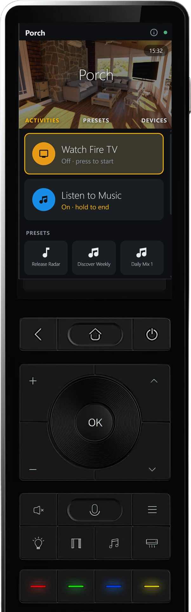

# Harmonium

**Fast-loading remote control dashboards for Home Assistant.** Aimed at low-power Android hardware remotes (Sanytron Astrion, Haptique RS90 and  
similar), while running equally well in any browser, on tablets, and on embedded Linux (WPE WebKit/Cog). Long-term: a product other HA users can adopt — not just a personal fix.

<p align="center">
  
</p>

<p align="center">
  
  
  
  
</p>

## Why

I miss the simplicity of the Logitech Harmony, activity + device control through a dedicated handheld remote. Home Assistant takes our control powers to a whole new level.

The new generation of physical remotes (Astrion, Haptique, UnfoldedCircle) have tremendous potential but, by nature, they have modest hardware that struggles with the massive load of the HA UI. Each tries to work around that by providing custom cards to talk to HA. In some cases they use both the remote hardware AND bridges to HA to do their work. But development is slow. Community leverage is weak and as a result, all the products show promise, but none IMO, sufficiently solves real world use cases.


For me, the goal is not to replace my complex tablet and browser based dashboards that manage every aspect of my "smart home". I have that already. And a tablet/browser is the right form factor to interface with it. For me, it started the way it probably started for you: a coffee table full of remotes.

I wanted an AV first replacement, and thus was born **Harmonium**.

The bottleneck on remote hardware is not the webview — it is the stock HA frontend: a multi-megabyte bundle plus a websocket firehose of every entity in your instance. Harmonium subscribes to **only the** **entities on the current screen** (~20 messages instead of thousands) and renders them with a dependency-free engine that ships as **one** **auditable HTML file**. The result on a Sanytron Astrion or Haptique RS90: a fast load and a responsive page — not the multi-second Lovelace crawl.

## What it does

- Loads fast on old hardware. The engine is one HTML file with no framework, and it runs on webviews as old as Chromium 61 (the Astrion's built-in one).
- Activities, Harmony-style. "Watch Fire TV" turns on the TV, the soundbar and the right input, HA-side. Every remote in the house sees the same thing running.
- Physical buttons do the right thing. During an activity the D-pad drives the device; on a device's page it drives that device; everywhere else it moves the cursor on screen.
- A page for every device type: switches, buttons and scenes, locks (hold to unlock), numbers, dropdowns, a real light dimmer, thermostats, fans, covers, media players.
- Control groups: several devices as one card, each drawn the way you say.
- Now Playing with album art, a music library browser with search, and one-tap presets (Netflix, a radio station, a scene).
- One design language across every tile, with your own accent colors and real brand colors for apps and devices.
- Icons from everything installed in your HA: Material, brand icon packs, MDI, and any custom icon sets you have added.
- A Studio, built into HA as a panel, where you build all of it visually. The preview is the real engine, drawn inside a photo of your remote.
- Pairing with a short code instead of copying tokens onto a kiosk device.
- Your remotes on one page: every paired remote, its battery, a one-click battery alert, and Save & Deploy that reloads all of them.
- Activities you can start and stop from outside Harmonium — a wall switch, an automation, anything that can call a service.
- Workspaces, so a second remote can have a different world.

## 📺 Video tutorials — watch it built

Four short videos take you from nothing to a working remote:  
install, two common activities, and device control.

|  |  |  |  |
| ---------------------------------------------------------------------------------- | --------------------------------------------------------------------------------- | ---------------------------------------------------------------------------------------- | ---------------------------------------------------------------------- |
| **[1 · Install via HACS](https://youtu.be/2E28x7pt36k)**                           | **[2 · Watch TV activity](https://youtu.be/M75ZPYvorUM)**                         | **[3 · Listen to Music activity](https://youtu.be/vALzJylJLSw)**                         | **[4 · Presets & Devices](https://youtu.be/lhVmuL7QHfs)**              |

## The Studio

Everything is built visually in the Studio, an HA panel: screens, activities, presets and key bindings, with a live preview that IS the real engine — rendered inside a photo of your remote, physical buttons mapped by dragging hotspots onto the photo, and new remotes approved with a pairing code, no tokens copied anywhere. Build a 
working activities page with connected controllers in half an hour.
(The tutorials above show all of it in motion.)


## Gallery

Short walkthroughs, mostly pictures. Each one is a thing you can do in the Studio in a few minutes.

| | |
| --- | --- |
| [**Entity support and variants**](docs/pictorials/Entity%20Support%20and%20variants.md) — pick a tile, choose how it draws, see it in the preview | [**Styling tiles**](docs/pictorials/Styling%20Tiles.md) — group defaults and individual overrides |
| [**Control groups**](docs/pictorials/Control%20Groups.md) — create a group, populate it, choose how each member draws | [**A custom controller**](docs/pictorials/Custom%20Controller.md) — clone a stock controller, change it, pick it for an activity |

<p align="center">
  <a href="docs/pictorials/Styling%20Tiles.md"></a>
</p>
<p align="center">
  <a href="docs/pictorials/Entity%20Support%20and%20variants.md"></a>
</p>

## Quick start

#### This is an early release. It is running on 2 HA instances that I have, but YMMV. Please provide feedback so I can make it more robust, as needed. Right now, we don't use on-remote IR (I have Bond units, but it should probably be on the t0-do list). There are likely loads of tweaks needed - so feel free to open issues and requests.

**📺 Every step below is also on video — see** **[Video tutorials](#-video-tutorials--watch-it-built) above.**

1. **Install the integration** — add this repo as a [custom repository in HACS](https://hacs.xyz/docs/faq/custom_repositories) (`skavan/harmonium`, type *Integration*), install **Harmonium**, restart HA, then add the integration under *Settings → Devices & services*. It deploys the engine to `/local/harmonium/` by itself.
2. **Open the Studio** — it appears in HA's sidebar. Build your first
  page, or just look around the starter config.
3. **Point a device at it** — open `http://<your-ha>:8123/local/harmonium/index.html` in any browser, tablet or remote webview. Tap **Pair with Home Assistant**, then approve the code in the Studio. Done.

> **🌐 No special hardware required — Harmonium is a web page.** Everything above runs in **any browser** (desktop, tablet, phone, TV webview) at:
>
> ```
> http://<your-ha>:8123/local/harmonium/index.html
> ```
>
> Open it on your laptop right now and drive the house with your keyboard — the hardware remote is the same page in a kiosk.

The full walk-through (including hardware remotes) is in **[GETTING-STARTED.md](docs/GETTING-STARTED.md)**.

### Putting it on a hardware remote

This is where Harmonium earns its keep — and the physical buttons are half of it, so don't skip this part. **Harmonium ships a ready-made KeyMapper profile for the Sanytron Astrion / HA100**: the whole button story — app-launcher keys, volume/mute/menu, the long-press escape hatches — restores onto a fresh remote in two taps, no button-by-button authoring.

1. **Hardware prep** (once per remote): follow **[our end-to-end Astrion/HA100 setup guide](remotes/astrion/README.md)** — Fully Kiosk, Key Mapper via the **IME path** (required on current firmware, where the older Expert-Mode method dies at reboot), KISS as the Home app, wireless ADB on the Blue key, and the Fully settings applied in one import. It builds on [Brad Sanders' community guide](https://community.home-assistant.io/t/astrion-remote-for-home-assistant-sideloading-fully-kiosk-button-remapping-guide/1008570) (credit where due) but supersedes its Key Mapper steps. **And check the Astrion's webview** (ⓘ shows the version — if it reads Chromium 61, [update it](docs/GETTING-STARTED.md#%EF%B8%8F-update-the-webview--do-this-its-two-minutes)).
2. **With the remote on USB**: run `remotes/setup-remote.bat` from the repo
  root (locks the display to portrait and warns — without changing
  anything — if the HA100's factory display density of 220 has been lost), then `remotes/push-keymapper.bat` — it pushes the bundled profile (current units: [`remotes/astrion/keymapper/v2/`](remotes/astrion/keymapper/v2/), the IME-path config with the wireless-ADB sound cues; `v1/` remains for Expert-Mode-era units) and opens KeyMapper; finish with **⋮ → Restore**. Prefer doing it by hand? The mapping is documented key-by-key — including the decoded shell commands — in [`astrion-remote-map.md`](remotes/astrion/keymapper/v2/astrion-remote-map.md).
3. **Point Fully Kiosk at the URL above**, pair, and pick up at [our hardware-keys cookbook](docs/cookbook/hardware-keys.md) for what every key does — including the glyph row you can bind to anything in the Studio.
4. **Turn on Remote Administration in Fully** (Settings → Remote Administration → enable, set a password). Then you never touch the remote's tiny settings screens again: manage every Fully setting from a desktop browser at `http://<remote-ip>:2323` (the remote's IP is on Harmonium's ⓘ screen), and HA's Fully Kiosk integration gets its device buttons — *Clear browser cache*, *Load Start URL* — which are also Harmonium's update failsafe.

## Cookbook

Task-shaped guides, one outcome each — start here after install:

| Guide                                                                         | You end up with                                      |
| ----------------------------------------------------------------------------- | ---------------------------------------------------- |
| [Your first screen](docs/cookbook/first-screen.md)                            | A room page with live tiles                          |
| [Activities](docs/cookbook/activities.md)                                     | "Watch TV" that turns everything on, in order        |
| [How controllers work](docs/cookbook/how-controllers-work.md)                  | The mental model: controllers, casts, the preview    |
| [Creating an Activity — the deep dive](docs/cookbook/creating-an-activity.md) | Every tab, every knob, with screenshots              |
| [Presets](docs/cookbook/presets.md)                                           | One-tap Netflix / scene / favorite buttons           |
| [Mapping a physical remote](docs/cookbook/remote-map.md)                      | A new remote model fully described, end to end       |
| [Creating a dialect](docs/cookbook/creating-a-dialect.md)                    | Teach a new platform (Apple TV) its apps and keys    |
| [The device photo](docs/cookbook/device-photo-skin.md)                        | The Studio preview inside a photo of *your* remote   |
| [Hardware keys](docs/cookbook/hardware-keys.md)                               | Physical buttons doing the right thing on every page |
| [Workspaces](docs/cookbook/workspaces.md)                                     | A second remote with a different world               |
| [Theming](docs/cookbook/theming.md)                                           | Your accent, your radius, per-device fonts           |
| [Wipe & reinstall](docs/cookbook/wipe-and-reinstall.md)                       | A box with zero trace, for a clean test              |
| [Removing Harmonium](docs/cookbook/remove-harmonium.md)                      | Complete removal — HA, data, tokens, and the remotes |

Hand-edited config beyond what the Studio surfaces: the config  
contract lives in [screen-schema.md](docs/screen-schema.md).

## How it's built

| Piece           | What it is                                                                                                               | Ships as                                        |
| --------------- | ------------------------------------------------------------------------------------------------------------------------ | ----------------------------------------------- |
| **Engine**      | The remote UI: screens, tiles, activities, D-pad focus, passthrough, media library + search                              | `dist/index.html` — one file, zero deps         |
| **Integration** | HA custom component: config store, validate→store→deploy API, `harmonium.*` services, pairing broker, engine self-deploy | `custom_components/harmonium/`                  |
| **Studio**      | The visual editor, hosted as an HA panel — the live preview is the real engine                                           | `studio-src/` (Svelte 5) → single `studio.html` |
| **Config**      | Pure data: screens, tiles, activities, keymaps, theme — owned per house by its HA                                        | `www/harmonium/config.json` on each house       |

The engine's enforced compatibility floor is **Chromium 61** (the Astrion's built-in fallback), because some remotes ship vendor-frozen webviews and that floor is the normal case. A Playwright battery of 120-plus probes drives the real engine and the real Studio against stubbed websockets on every change.

Architecture, doctrines and the full decision log:  
[ARCHITECTURE.md](docs/ARCHITECTURE.md) ·  
[PROJECT.md](docs/PROJECT.md) ·  
[design/notes](docs/design/notes/README.md) — the reasoning behind the bigger pieces

> **`dist/config.json` is a test fixture, not a deployable.** Code is shared; config belongs to each house's Home Assistant and is never pushed from the repo. See `houses/README.md` for the multi-house model.

## Developing & contributing

```sh
node build-engine.mjs            # engine → dist/index.html (no npm, no bundler)
cd studio-src && npm run build   # Studio → integration/.../studio/studio.html
cd dist && python3 -m http.server 8482 &
cd tests && for t in smoke-*.mjs; do node "$t"; done   # errs must stay empty
```

Fork setup, deploy scripts (`build-push.bat` and friends, driven by `houses\default.txt`), the house style, and what makes a good PR: **[CONTRIBUTING.md](CONTRIBUTING.md)**. Security model and how to report issues: **[SECURITY.md](SECURITY.md)**.

## Status

Beta, v0.87.0. It runs every day on two Sanytron Astrions and a Haptique RS90 (Fully Kiosk) across two houses, and a handful of testers are running it on theirs.

What's new in this release, and in every release before it: [releases/release-notes-v0.87.0.md](docs/releases/release-notes-v0.87.0.md) · [all release notes](docs/releases/).

What's next: [beta-gaps.md](docs/beta-gaps.md) is the living roadmap; [PROJECT.md](docs/PROJECT.md) is the decisions log.

## Asks

Really need some testers to:

1. Make sure HACS install works outside of my little world.
2. Do a run through of all the basics
3. Help wire up the dialects needed for Apple TV and other popular platforms
4. Identify bugs, warts and inconsistencies
5. Identify missing Tile types and how they should work (i.e. Conditional Tiles)
6. **Weigh in on the D-pad targeting model** — D-pad/Back/Home drive the on-screen remote everywhere *except* TV pages, where taps drive the television. Does that resonate, or does it fight your thumbs? The discussion: [issue #5](https://github.com/skavan/harmonium/issues/5).

## License

[GPL-3.0](LICENSE). Use it, fork it, improve it — but derivatives you distribute must stay open source under the same terms.
