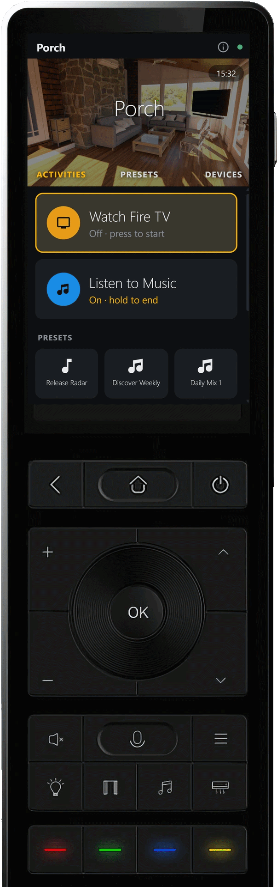
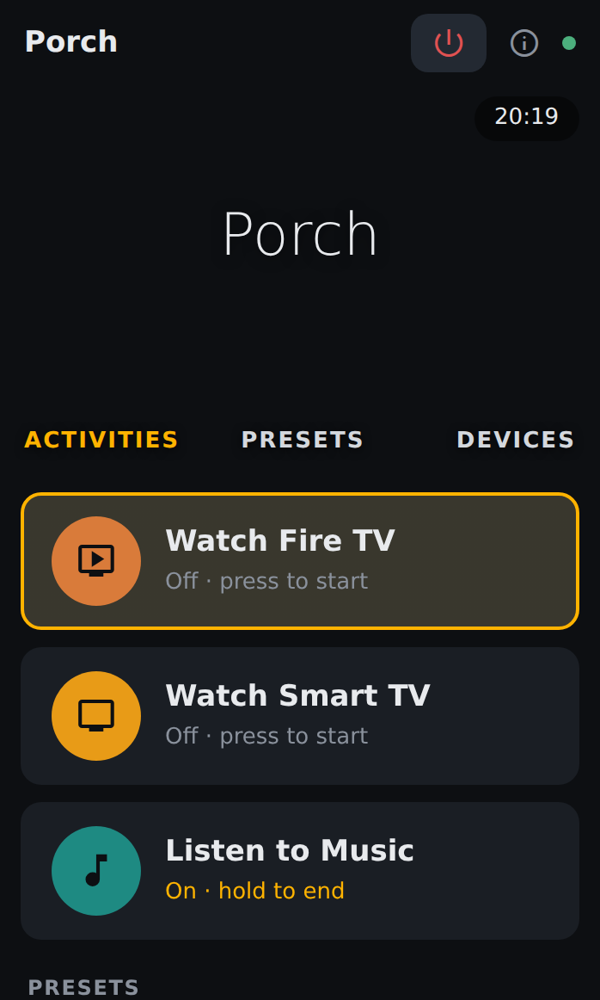
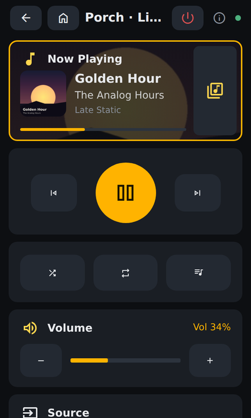
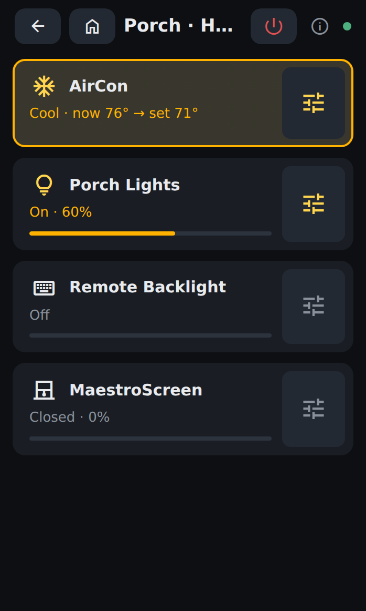
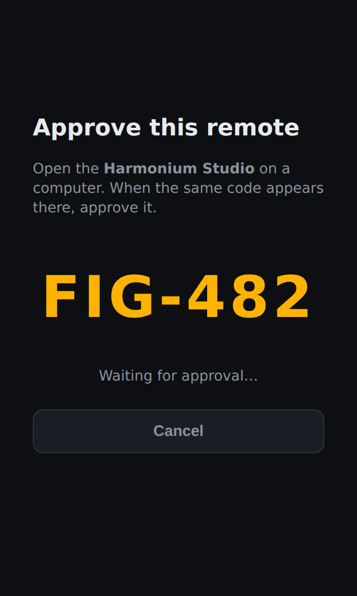
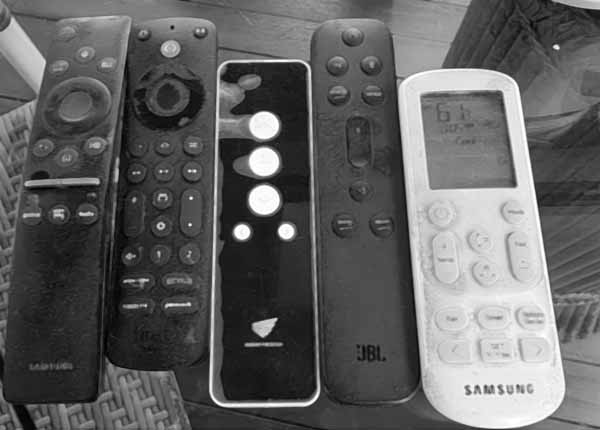
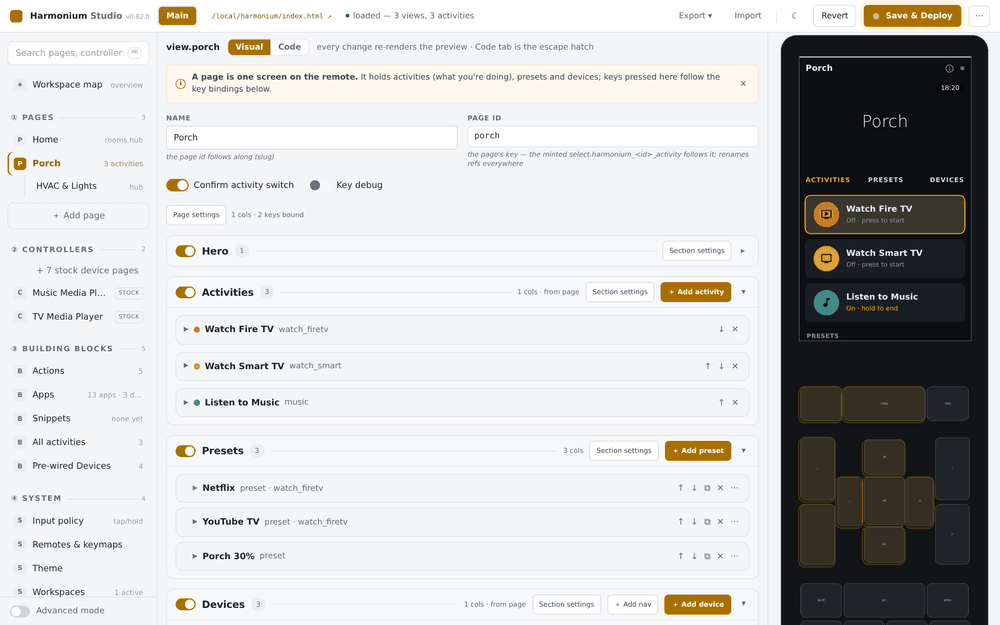
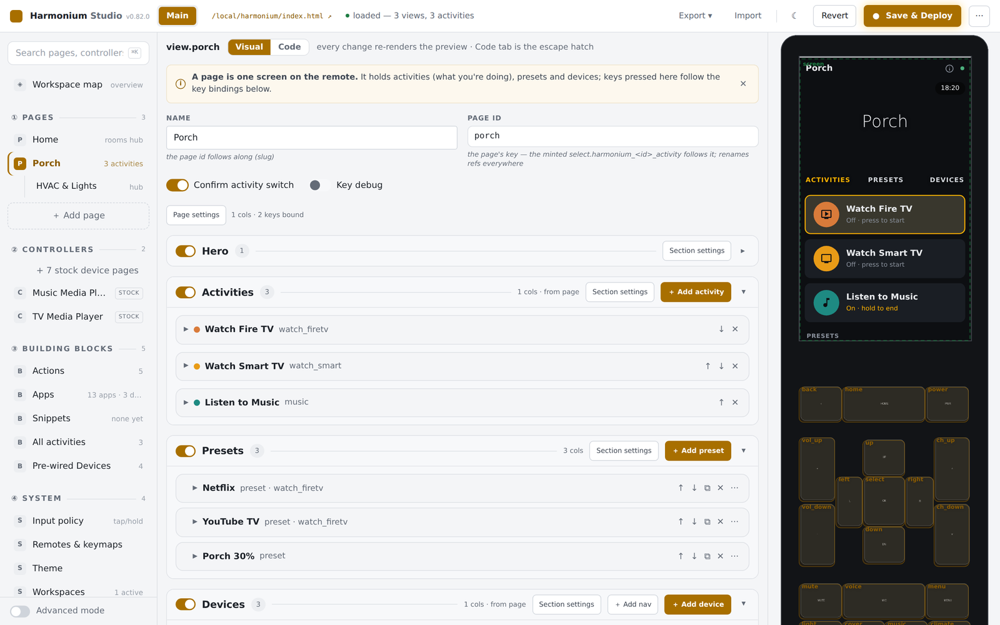
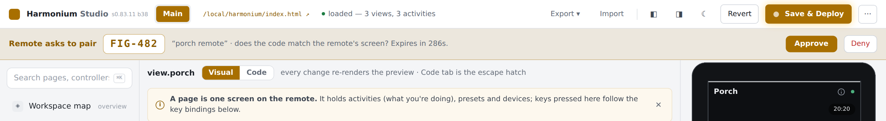

# Harmonium

**Instant-on remote control dashboards for Home Assistant.** Aimed
at low-power Android hardware remotes (Sanytron Astrion, Haptique RS90 and
similar), while running equally well in any browser, on tablets, and on
embedded Linux (WPE WebKit/Cog). Long-term: a product other HA users can
adopt — not just a personal fix.

<p align="center">
  
</p>

<p align="center">
  
  
  
  
</p>

## Why

I miss the simplicity of the Logitech Harmony, activity + device control through a dedicated handheld remote. Home Assistant takes our control powers to a whole new level.

The new generation of physical remotes (Astrion, Haptique, UnfoldedCircle) have tremendous potential but, by nature, they have modest hardware that struggles with the massive load of HA UI. Each tries to work around that by providing custom cards to talk to HA. In some cases they use both the remote hardware AND bridges to HA to do their work. But development is slow. Community leverage is weak and as a result, all the products show promise, but none IMO, sufficiently solves real world use cases.



For me, the goal is not to replace my complex tablet and browser based dashboards that manage every aspect of my "smart home". I have that already. And a tablet/browser is the right form factor to interface with it. For me, it started the way it probably started for you: a coffee table full of remotes.

I want an AV first replacement - and thus was born **Harmonium**.

<br clear="both" />

The bottleneck on remote hardware is not the webview — it is the
stock HA frontend: a multi-megabyte bundle plus a websocket firehose
of every entity in your instance. Harmonium subscribes to **only the
entities on the current screen** (~20 messages instead of thousands)
and renders them with a dependency-free engine that ships as **one
auditable HTML file**. The result on a Sanytron Astrion or Haptique
RS90: the screen is live before your thumb reaches the D-pad.

- **Instant on.** Fast cold boot on vendor-frozen Chromium 75
  webviews. No framework, no bundle, no loading spinner.
- **Buttons are first-class.** Full D-pad / spatial-focus operation.
  During an activity, the physical D-pad *is* the device's D-pad
  (Harmony-style passthrough); touch always drives the UI.
- **Activities live in HA, not the remote.** Start "Watch Fire TV"
  and the TV, soundbar and input switching run HA-side; the remote is
  a dumb, fast 2-way window onto them. Every remote in the house agrees
  about what's running.
- **Pairing, not tokens.** A new remote shows a short code; you
  approve it in the Studio. No copying long-lived tokens onto a
  kiosk device.
- **A real editor.** The Studio runs as an HA panel. Its live preview
  IS the engine — rendered inside a photo of your remote, with every
  physical button mapped and washed live as bindings change.
- **Opinionated, but highly configurable**. The Studio generated pages are "opinionated". The height of a tile, the fonts, the border-radius and so on. But almost all of these are configurable and as I learn more, I (and the community) can do more.

## The Studio

Edit screens, activities, presets and key bindings visually; the
preview renders the real engine inside your device's photo and
follows every change live. It should be possible, to build a working Activities page, with connected controllers in 30 minutes or less.

<p align="center">
  
</p>

Map your remote's physical buttons by dragging hotspots straight onto
its photo — the preview then shows which keys do what on every page,
with tooltips spelling out each binding:

<p align="center">
  
</p>

When a new remote asks to join, the Studio shows the same code the
remote does. One click mints it a named, revocable token:

<p align="center">
  
</p>

## Quick start

#### This is an early release. It is running on 2 HA instances that I have, but YMMV. Please provide feedback so I can make it more robust, as needed.

1. **Install the integration** — add this repo as a
   [custom repository in HACS](https://hacs.xyz/docs/faq/custom_repositories)
   (`skavan/harmonium`, type *Integration*), install **Harmonium**,
   restart HA, then add the integration under *Settings →
   Devices & services*. It deploys the engine to
   `/local/harmonium/` by itself.
2. **Open the Studio** — it appears in HA's sidebar. Build your first
   page, or just look around the starter config.
3. **Point a device at it** — open
   `http://<your-ha>:8123/local/harmonium/index.html` in any browser,
   tablet or remote webview. Tap **Pair with Home Assistant**, then
   approve the code in the Studio. Done.

The full walk-through (including hardware remotes) is in
**[docs/GETTING-STARTED.md](docs/GETTING-STARTED.md)**.

### Putting it on a hardware remote

For the Sanytron Astrion / HA100-class remotes, Brad Sanders'
excellent community guide covers the hardware prep — sideloading
Fully Kiosk, installing KeyMapper, remapping buttons:
**[Astrion Remote for Home Assistant — sideloading, Fully Kiosk,
button remapping](https://community.home-assistant.io/t/astrion-remote-for-home-assistant-sideloading-fully-kiosk-button-remapping-guide/1008570)**.
Once Fully Kiosk is running, point it at the URL above and pick up at
[our hardware-keys cookbook](docs/cookbook/hardware-keys.md).

## Cookbook

Task-shaped guides, one outcome each — start here after install:

| Guide | You end up with |
|---|---|
| [Your first screen](docs/cookbook/first-screen.md) | A room page with live tiles |
| [Activities](docs/cookbook/activities.md) | "Watch TV" that turns everything on, in order |
| [Presets](docs/cookbook/presets.md) | One-tap Netflix / scene / favorite buttons |
| [The device photo](docs/cookbook/device-photo-skin.md) | The Studio preview inside a photo of *your* remote |
| [Hardware keys](docs/cookbook/hardware-keys.md) | Physical buttons doing the right thing on every page |
| [Workspaces](docs/cookbook/workspaces.md) | A second remote with a different world |
| [Theming](docs/cookbook/theming.md) | Your accent, your radius, per-device fonts |

The older [config recipe collection](docs/cookbook.md) goes deeper
into hand-edited config for things the Studio doesn't surface yet.

## How it's built

| Piece | What it is | Ships as |
|---|---|---|
| **Engine** | The remote UI: screens, tiles, activities, D-pad focus, passthrough, media library + search | `dist/index.html` — one file, zero deps |
| **Integration** | HA custom component: config store, validate→store→deploy API, `harmonium.*` services, pairing broker, engine self-deploy | `custom_components/harmonium/` |
| **Studio** | The visual editor, hosted as an HA panel — the live preview is the real engine | `studio-src/` (Svelte 5) → single `studio.html` |
| **Config** | Pure data: screens, tiles, activities, keymaps, theme — owned per house by its HA | `www/harmonium/config.json` on each house |

The engine targets **ES2019 / Chromium 75**, because cheap remotes
ship vendor-frozen webviews and that floor is the normal case. A
20-suite Playwright battery drives the real engine against stubbed
websockets on every change.

Architecture, doctrines and the full decision log:
[docs/ARCHITECTURE.md](docs/ARCHITECTURE.md) ·
[docs/PROJECT.md](docs/PROJECT.md)

> **`dist/config.json` is a test fixture, not a deployable.** Code is
> shared; config belongs to each house's Home Assistant and is never
> pushed from the repo. See `houses/README.md` for the multi-house
> model.

## Developing & contributing

```sh
node build-engine.mjs            # engine → dist/index.html (no npm, no bundler)
cd studio-src && npm run build   # Studio → integration/.../studio/studio.html
cd dist && python3 -m http.server 8482 &
cd tests && for t in smoke-*.mjs; do node "$t"; done   # errs must stay empty
```

Fork setup, deploy scripts (`build-push.bat` and friends, driven by
`houses\default.txt`), the house style, and what makes a good PR:
**[CONTRIBUTING.md](CONTRIBUTING.md)**. Security model and how to
report issues: **[SECURITY.md](SECURITY.md)**.

## Status

Beta. Daily-driving on a Sanytron Astrion and a Haptique RS90 (Fully
Kiosk) across two houses. Recent: code-match pairing, HACS packaging
with engine self-deploy, device-photo skins with button mapping, the
on-device diagnostics page, media library routing ("the cast player
decides"), and the engine-side Sonos index. Roadmap and open items:
[docs/PROJECT.md](docs/PROJECT.md).

## License

[GPL-3.0](LICENSE). Use it, fork it, improve it — but derivatives you
distribute must stay open source under the same terms.
