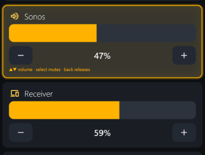

1. Volume control tile not very responsive to +/- change It jumps forward like 5pts and then jumps back like 3.
2. Beta doc is out of date. 
3. Need to add the KeyMapper stuff to getting started. You will note I've unpacked the zip in remotes\keymapper\astrion and added an md and an xlsx of the map.
4. At the top of each .MD we should say what the prupose of the doc is and its intended audience
5. Have we updated relevant docs with the Group Players stuff?
6. Do we need a doc for devs to understand the purpose of all the .bat's in repo root. Are any of them redundant now?
7. In a browser, Mute is a problem.  

  I think we should enable click on icon to mute/unmute. And on remote, the mute button should mute button should mute the Volume role tile - unless another tile with Volume is actually selected (like receiver) and then it should mute that. Open to other ideas.
