# Creating an Activity

*Purpose: Every tab and knob of the activity editor, with screenshots — the deep dive. Audience: users who want the whole picture.*

**Outcome:** a "Watch Fire TV"-class activity, built end to end — the
cast of devices, who does what, what gets switched on and to which
input, what the remote shows while it runs, how Harmonium knows it's
really on, and how it ends. Every knob on every tab, and the ideas
behind them.

This is the long-form version of [Activities](activities.md). Read
that one first if you just want "Watch TV" working in five minutes;
read this one when you want to understand what each control actually
does. **📺 Both builds also exist as videos:
[Watch Fire TV activity](https://youtu.be/M75ZPYvorUM) ·
[Listen to Music activity](https://youtu.be/vALzJylJLSw).**

---

## The ideas first

Five concepts carry the whole editor. Everything on every tab is one
of these wearing a label.

**An activity has state, and it has things you do to it — and the
two are separate.** The state is one question: *is it running?* The
answer lives in a select entity
(`select.harmonium_<page>_activity`) that the Harmonium integration
creates for every page that owns activities — so Home Assistant
holds the answer, and every remote in the house reads the same one
and agrees. Everything else — turning devices on, switching inputs,
powering things down — is what you *do around* the state change,
and it's all optional and editable. Harmony welded the two
together: start Listen to Music and it force-marched Watch TV
through a power-off macro, and if that macro got interrupted, its
idea of the world was wrong until you "fixed" it. In Harmonium,
starting another activity changes *which one is running* and
nothing more — nothing gets powered off unless you asked for it.

**Activities live on a room page.** Any hub page can own them; the
first activity you add marks the page as a *host* (permanently —
that's what keeps its select entity alive). The page's Activities
section renders the tiles; the activity is a card inside that
section.

**An activity has a cast of actors — devices — and the cast has
roles.** Casting says *who's involved*: the TV, the Fire TV, the
soundbar. Roles say *who does what*: who is the media player, who
reacts to the D-pad, who takes the volume keys, who the power
button drives, whose input list the source picker offers. Every
control on the remote routes through a role, and each role is
played by one device. The first cast member is the **primary** —
the activity's face, and the default answer to "is it running?".

**Harmonium is smart about the roles — and lets you save the
result.** When you pick a device, it works out the likely roles
from the device's entities: the `media_player` entity should play
media, its sister `remote` entity should take navigation. Sister
entities come along for the ride — a media_player and its remote
travel as one device. You can override any of it. The finished
combination — the device, its sisters, and their roles — can be
saved and retrieved from a library (Model →
**Pre-wired Devices**), and that's all *pre-wired* means: the roles
are already worked out, so next time the device is retrieved, not
re-guessed.

**A claim is a device saying "I can play that role."** "I'm a
media_player — I claim the media_player role." That's the whole
idea; the word shows up in the UI as the count on a library card
("3 claims") and as *— no claim —* in its role dropdowns. Claims
live in the library and travel with the device; they are offers,
not decisions. The *decision* — who actually plays each role in
**this** activity — is made when you cast (first suitable claim
takes the role) and changed on the **Roles** tab. That's why a
later cast member with the same claims sits there holding nothing:
it's an *understudy*, cast and ready, until you hand it a role.
A library entry also carries a *dialect* (the platform vocabulary
the device speaks: Fire TV, Tizen, Google TV — keys, app launches,
channels) and *traits* (how it wakes: wake entity, wait-until-on,
settle delay, cold-start steps — and whether it must **never** be
turned off).

  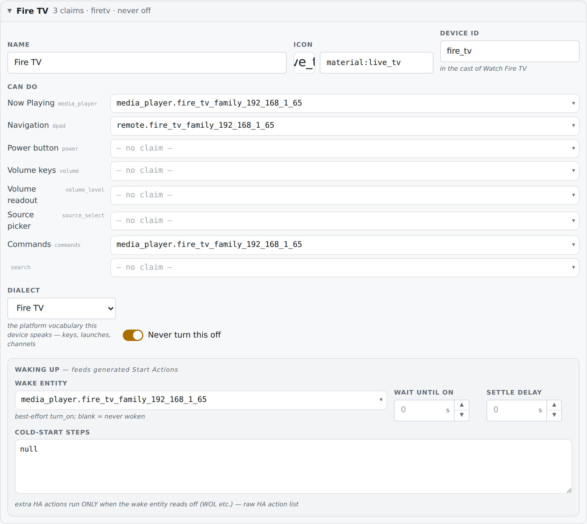

**The controller is a shared surface.** "Navigate to" points the
activity at a control page — usually a stock controller (TV Media
Player, Music Media Player). Stock surfaces are shared: the *same*
page serves every activity that lands on it, reading this
activity's wiring through `$context.*` tokens at runtime. That's
why editing a stock controller changes every activity that uses it,
and why the editor offers "Create custom copy" when you want one of
your own.

---

## 0. Before you start

Open the Studio: it's **Harmonium Studio** in Home Assistant's
sidebar. You need a room page (on a fresh install the starter's
"New Room" home page is exactly that; to make your own, see [Your
first screen](first-screen.md)) and, ideally, the devices you'll
cast visible in HA. That's it. You do *not* need to pre-build
devices, sequences, or a controller — the editor creates all three
on demand.

**The route you'll take** — ten steps, each detailed in the
sections below:

1. On your room page, **Activities → ＋ Add activity**.
2. Name it (the id follows along; pin it if you care).
3. **Setup**: say what you're building, and point **Navigate to**
   at a controller — the stock *TV Media Player* / *Music Media
   Player*, or **＋** to give the activity a page of its own.
4. **Cast the devices**, the one that plays first — it becomes the
   primary. Watch the preview build the controller as you go.
5. **Roles**: check who does what; wire anything the controller
   consumes that's still hollow.
6. **Inputs**: for each device that switches inputs, say where it
   should be.
7. **Actions**: **⚙ Start Action**; tick the devices that should
   power off when it ends, then **⚙ Stop Action**. Leave
   confirm-before-ending on. Two more switches live here:
   **Confirm before switching away** (press-twice guard when another
   activity would replace this one) and **Run my Stop when another
   activity starts** — off by default, because the incoming
   activity's Start owns the transition and shared devices must not
   flicker; switch it on for activities whose Stop touches only
   their own gear (music's stop touches only the Sonos).
8. **State**: usually leave the default. If your primary never
   powers off (a Fire TV), use **⚙ From inputs**.
9. **Save & Deploy**, then reload the remote.
10. Tap the tile on the remote. Done.

## 1. Add the activity

Open your room page in the Studio and find the **Activities**
section. Every hub has one (off until it owns something); **＋ Add
activity** creates the activity and opens its card.

  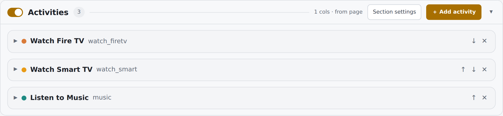

What one click just did: created an activity (`new_activity`, name
"New Activity", confirm-before-ending ON) owned by this page
(`room_view`), marked the page as a host, and made sure the page
has an `activities` generator tile so the new activity renders. The
collapsed row shows its accent dot, name, and id; ↑↓ reorder
activities (that's tile order on the remote too), ✕ removes —
with a confirmation that **names everything still referencing it**
(tiles, presets), because those references go stale rather than
disappear.

## 2. The identity strip

Present on every tab, top of the card.

- **Display name** — what the tile says. Tiles that already show
  this activity follow a rename live (their baked labels are kept
  in sync).
- **Icon** — the picker takes Material Symbols names
  (`material:live_tv`); synced onto referencing tiles the same way.
- **Accent** — the activity's color: the tile's icon disc and the
  card's dot.
- **Activity id** — the config key. While it still auto-follows the
  name you'll see it re-slug as you type; edit it once and it's
  pinned. Changing it renames the key *everywhere* in the config —
  tiles, sequences, select options.

## 3. The tabs and their dots

**Setup · Roles · Inputs · Actions · Controller · State**, with
**Advanced** on the far right. (The Controller tab carries the
activity's preset count — the presets editor lives there.) Each tab carries a completion dot:
**full green** = answered, **pale green** = partly answered (which
can be a valid final state — one input answered out of three is a
choice, not an error), **hollow** = untouched. The dots are the
Harmony wizard flattened into addressable tabs: answer them in any
order, come back any time.

Next to the tabs, the **Preview** toggle (visible once the activity
has both a page and a controller) flips what the right-hand preview
shows while you edit: the **Controller** (what running looks like)
or the **Room page** (what the tile looks like).

## 4. Setup — the shape and the cast

  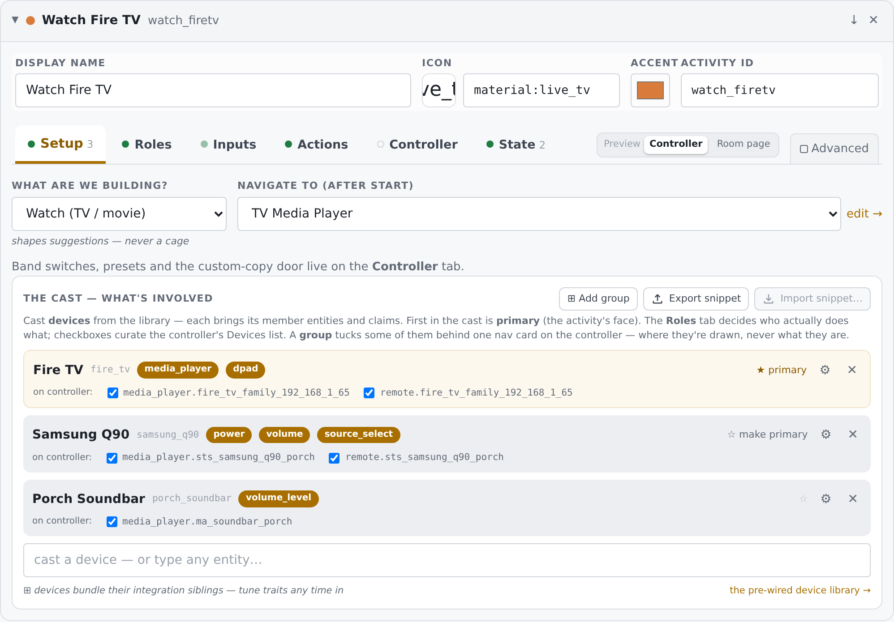

**What are we building?** — Watch / Listen / Play / Custom. It
shapes suggestions (which controller gets offered, which roles
matter) and nothing else: "never a cage."

**Navigate to (after start)** — where the remote lands when the
activity starts. The dropdown offers **Controllers** (the stock
library and your copies) and **Pages & views**. Leave it blank and
the tap stays on the room page. With nothing picked, the **＋**
button *creates a control page* for this activity: a
controller-class screen named after it, with Now Playing +
Transport (if a media_player is wired), on-screen device buttons
for touch profiles and a D-pad card for physical-D-pad ones, a
Volume card, a Devices section listing the cast — and the page's
`control_target` pre-wired to `$context.*` with full key
passthrough. You land in it as a *draft* with a Keep / Discard
banner. With a page picked, **edit →** jumps to it.

Everything about how that controller *renders* for this activity —
band switches, presets, the custom-copy door — lives on the
**Controller** tab (below).

### The cast

Cast devices with the picker at the bottom of the block — type a
name or an entity id:

  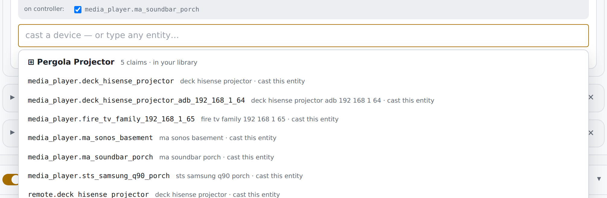

Three kinds of row: **⊞ already in your library** (shows its claim
count) — casting wires its claims into free roles immediately;
**⊞ will join your library** — an *implied bundle* the Studio
spotted in HA's registry (integration siblings grouped by device:
"media_player + remote"); picking it saves the pre-wired device
into your library first, then casts it; and a plain **entity id** —
cast directly, no bundle, no library entry (a pre-wired device is a
convenience, not a requirement). When in doubt, prefer the ⊞ rows —
they bring the sister entities and the imputed roles with them; a
raw entity brings only itself.

Each cast row shows: the device name (**a doorway** — click it to
open the device in the library, with a return trip back to this
card), its id, **role chips** for every role it currently holds,
and per-entity **"on controller:" checkboxes** — untick to hide
that entity's tile from the controller's Devices list *without*
unwiring any role. The row's controls:

- **★ primary** — first in the cast, holds the media_player role,
  is the activity's face and its implied-state witness. Any other
  cast member with a media_player claim offers **☆ make primary**;
  a device with no media_player claim shows a quiet disabled ☆ —
  it's a device, not the face.
- **⚙** — the presentation panel (below).
- **✕** — remove from cast; roles it held unwire.

Two honest annotations you may see: *"understudy — an earlier cast
member claimed its roles first"* (reassign on the Roles tab), and
*"no `<role>` claim — draws as a launcher into its own controller"*
(with a link to add the claim in the library).

### The ⚙ presentation panel

Per member — how this device *draws* on the controller:

  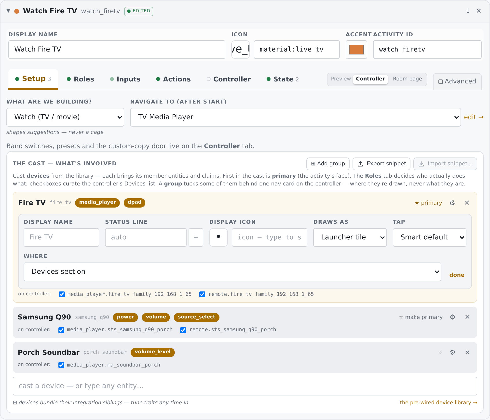

- **Display name** — blank = the device's own name. Clearing a name
  that was *saved* is intentional blank: the tile draws no label at
  all.
- **Status line** — the tile's second line. Blank = the widget's
  smart summary; `{curly}` tokens read the entity live (the **＋**
  menu lists the entity's real attribute names and inserts a
  token). Same intentional-blank rule as the name.
- **Display icon** — overrides the device icon on this tile only.
- **Draws as** — what the tile *is*. The list is intelligent: only
  modes this member can honour (a claimed role for devices; the
  entity's domain for loose entities). The full vocabulary:
  *Launcher tile* (opens the device's own controller — always
  available), *Volume control* (its shape — compact, slider,
  stepper — comes from the Volume style select beside it),
  *Power button*, *Now Playing*, *Transport*, *Source picker*.
- **Tap** — *Smart default*, *Its controller page*, or *Nothing — a
  pure readout*.
- **Volume style** — only where a volume control can exist: *Theme
  default*, *Compact*, *Slider — the fat one*, *Stepper − / +*.
  This rides a ladder: this panel first, then the activity's
  device options, then the theme. Four styles, four shapes:
  *Slider* is the fat track with the % readout in the − / + row;
  *Compact* is the title-line "Vol n%" with a mini meter between
  − / +; *Stepper* is Compact's layout with the fat track riding
  IN the row — drag it or step it; *Theme default* defers.
- **Where** — *Devices section* (the members' home) or *With the
  controls* (promoted up beside the main controls). A grouped
  member doesn't get this — its group decides where it's drawn.

An untouched panel writes nothing: empties are swept on **done**.

### Groups

**⊞ Add group** creates a group *in this activity* (it's a
per-activity decision, made nowhere else). A group is a **view,
never a device**: it tucks some of the cast behind one nav card on
the controller and a page behind it. Members stay first-class cast
— they keep their roles, their entities, their claims; only where
their control is *drawn* changes. The group's editor: **Name**,
**Icon**, **Where** (with the controls / Devices section), and
membership checkboxes over the cast (a device can live in one group
at a time). On each cast row, a per-device dropdown offers "on the
controller / in *group*" whenever groups exist. Removing a group
returns its members to the controller — nothing is uncast.

### Snippets

**⤴ Export snippet** captures the whole block — cast, wiring,
groups, presentation — as a reusable *setup snippet*;
**⤵ Import snippet…** replays one into another activity (your
"same AV stack, different room" move). The exact same grammar
appears on State and Presets.

## 5. Roles — which device fills each role

  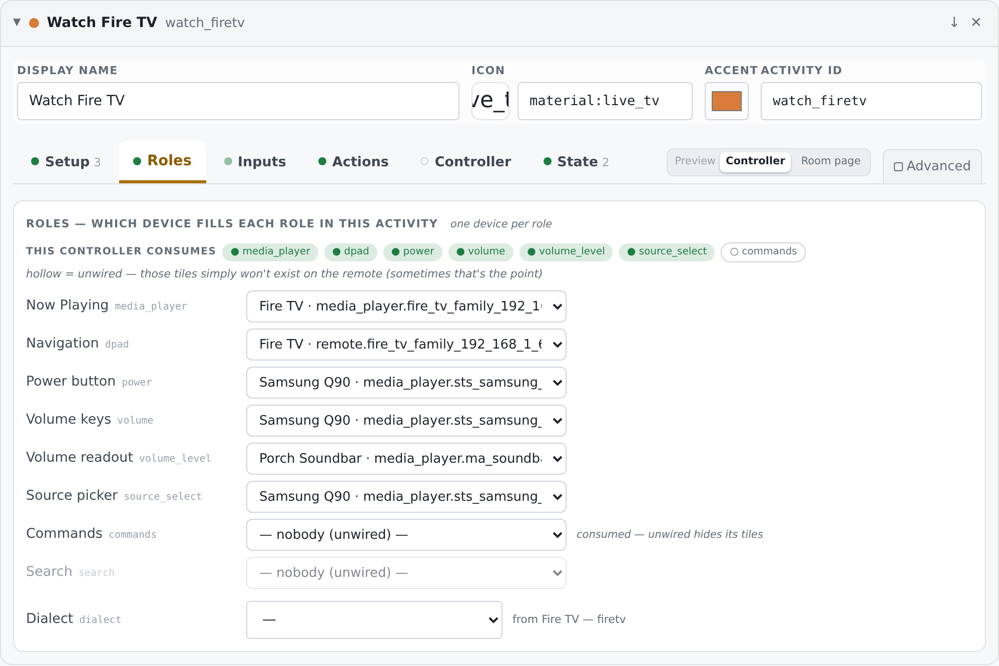

One device per role — a button press has one destination. The full
role vocabulary, with what each drives:

| Control | role | Drives |
|---|---|---|
| Now Playing | `media_player` | the media tile, transport, play/pause state |
| Navigation | `dpad` | arrows · select · back · home — physical keys pass through here |
| Power button | `power` | *device* power — the physical power tap and `$context.power` tiles. (The on-screen ⏻ ends/starts the *activity* and needs no wiring.) |
| Volume keys | `volume` | volume up/down, hardware and on-screen |
| Volume readout | `volume_level` | where the slider reads truth, when that differs from who takes the keys |
| Source picker | `source_select` | whose input list the Source tile offers |
| Commands | `commands` | app launches + system keycodes (the ADB entity on Android platforms) |
| Search | `search` | who answers a library search — usually the speaker's Music Assistant twin. Unwired = the library page simply offers no search |

If the activity has a controller, the **"This controller consumes"**
strip shows which of these that surface actually reads — filled
dot = wired, hollow = unwired, and hollow is sometimes the point:
*an unwired consumed role means those tiles simply won't exist on
the remote.* Roles the controller doesn't consume render dimmed but
stay editable (they apply if you switch controllers).

Each role's dropdown offers: every cast device that *claims* it
(named, with the claimed entity), loose cast entities of a fitting
domain, **＋ \<device\> — add the claim** (the rest of the cast:
able, just not yet declared — picking it writes the claim into the
library device *and* wires it here), and **an entity directly…**
(an entity picker; the entity is adopted into the cast). When
you've wired an entity that lives inside a cast device's bundle
without being a claim, a **↥ save claim** button offers to promote
the wiring into the library — so every *future* cast of that device
fills the role by itself.

**Dialect** — the platform vocabulary for launches and commands.
Blank = inherited from the primary device's bundle (the row says
where it came from); picking one pins it for this activity.

## 6. Inputs — what should each device be set to?

  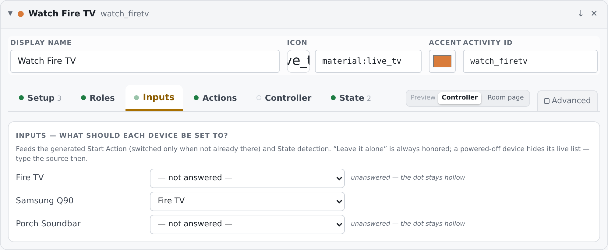

The Harmony question. One row per cast member that can switch
inputs (a `source_select` or `media_player` claim), each offering
its **live source list**: *— not answered —* (the dot stays
hollow), **Leave it alone (none / ignore)** — always honored,
never switched, a *choice* — a real source, or **type a source…**
for when the device is powered off and hiding its list.

The answers feed two things: the **generated Start Action**
(switched *only when not already there*) and **⚙ From inputs**
state detection. Nothing here runs by itself — it's declarative
until an action is generated from it.

## 7. Actions — start and stop

  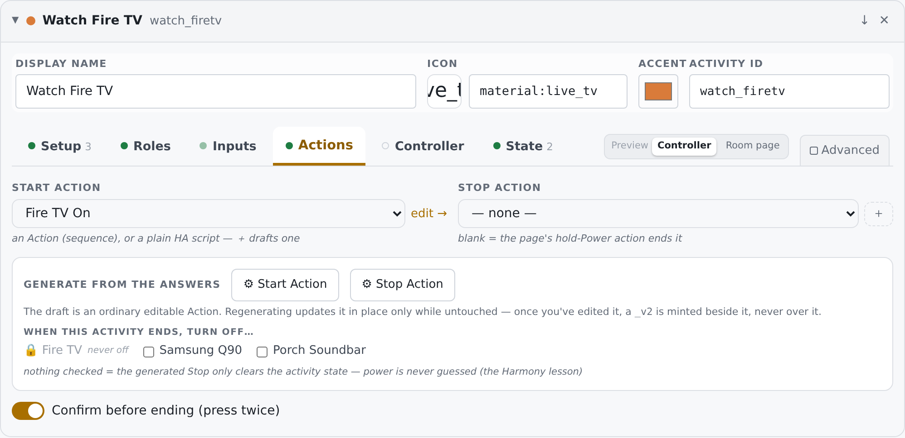

**Start action / Stop action** — each an *action ref*: one of your
sequences (Model → Actions, executed HA-side by
`harmonium.run` with full delay/wait/choose semantics) or a plain
HA `script.` entity. The **＋** drafts an empty named sequence
("\<Activity\> — Start") and jumps you into it; **edit →** opens
the current one. Two behaviors worth knowing:

- **No start action is legal.** The activity still becomes active —
  display state, context, controller all work; orchestration is
  opt-in, not a prerequisite.
- **No stop action** falls back, in order, to: the owner page's
  hold-Power binding → the current page's → the global one. If none
  exists, ending the activity reports "No stop action set" and
  changes nothing. (Note the flip side: during a running activity
  the power *tap* usually passes through to the wired `power`
  entity and toggles the device — that's a role at work, not a stop
  action.)

**Generate from the answers** — the two ⚙ buttons write a draft
sequence from everything the other tabs declared. The prime
directive: **power is never guessed.**

A generated **Start** is, in order: set the activity state
(`harmonium.set_activity`) → for each cast device with a `wake`
trait, a best-effort `turn_on` (`continue_on_error`) → a
*cold-start-only* block (runs only if the wake entity read `off`):
the device's cold-start steps, a wait-until-on with the trait's
timeout, a settle delay → for each answered Input, a conditional
source switch (*"ONLY if needed"* — skipped when the source already
matches). A generated **Stop** is: clear the room's routing — but **only if
this activity still owns it** (if another activity has taken the
room since, its routing is left alone) → a best-effort `turn_off`
for **exactly the devices you checked** under *"When this activity
ends, turn off…"*. Devices marked never-off in the library show a
🔒 and cannot be checked. Nothing checked = the Stop only clears
state — the Harmony lesson, enforced.

The drafts are ordinary editable sequences, named
"\<Activity\> — Start (generated)". Regenerating updates one **in
place only while untouched**; once you've edited it, a `_v2` copy
is written beside it — your edits are never overwritten.

**Confirm before ending (press twice)** — the first press turns the
tile red for a few seconds; the second ends it. On by default:
accidental toggle-off is the cardinal sin.

## 8. Controller — what the screen shows

  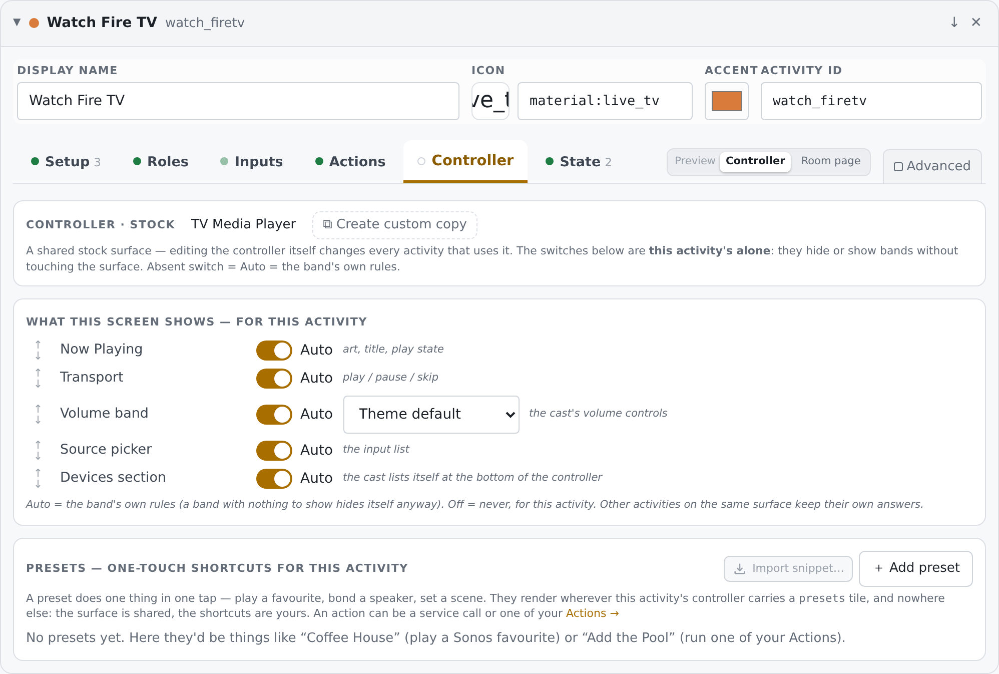

The question the other tabs never asked: *what does the screen show
while this runs?* Three blocks, top to bottom.

**The strip** — which surface this activity lands on: *stock*
(shared — editing the controller itself changes every activity that
uses it) with **⧉ Create custom copy** for structural surgery, or
*custom copy* with **edit →** and **↺ use stock**. The switches
below never need a copy — that's the point of the tab.

**The band switches** — one row per band the target controller
actually renders. Most rows carry a **label slot**: the greyed
placeholder shows what the band says today; type text to rename it
on the remote, for this activity only — empty text means NO label
at all, and ↺ restores the default. The Volume band's slot renames
the tile of the **Volume role's** device only — any other volume
control you've promoted into the controller is a per-device tile
and keeps its own ⚙ name. Presets and Devices slots rename their
**section headings**. **Now Playing** also picks its renderer here:
*Auto* (whatever the surface tile says), *Standard card*, *Slim
row* (one line — a play indicator + "Title — Artist" that
auto-scrolls when it overflows — for controllers where music is
background), *Art hero — side panel* (the artwork rides the right
edge at full strength and fades toward the text; the library jump
is a full-height fade-in zone over the art; this is the default
hero), or *Poster — big art + progress* (the phone-player shape:
big centered artwork, the track under it, a real progress bar with
elapsed/total times, and a full-width bar to the library beneath —
no transport or volume inside, those stay their own bands). On the
stock music controller Auto shows the side panel. (An older
*Art wash — full-bleed* renderer still works for configs that
chose it, but it's no longer offered fresh.) The rows:
Now Playing, Transport, Modes, the Volume band
(with this activity's default volume style — per-tile and per-member
settings still win), **Speakers** (the grouping card: link players
into the running group, and each joined row carries a separate
volume-link toggle — unlink it and the group volume slider leaves
that player at its own level while it keeps playing; Auto means
"appears when this activity has two or more players". Two extra
selects on this row: **Players** — the cast's, or a named **Speaker
Group** from Model → Speaker Groups ("Outdoor Music Players": a
workspace-level set of joinable players, independent of any cast —
the receiver that's only an amplifier stays out, the MA players
outside the cast get in; **＋ Create group…** in the select jumps
straight to that editor) — and **Card**: *Launcher* (a slim
"5 available · 2 linked" tile opening the group's own page) or
*Inline* (the full card on the controller). Group-fed defaults to
launcher, cast-fed to inline. Either way every player has a volume
row — [−] a fat track with the % riding inside it [+] — always out
on the group's page, and revealed on the inline card by tapping the
player's name, so levels get set *before* linking), Cast-group
cards (the navigation cards for groups made with **⊞ Add group** in
the cast), Source picker, the Presets band, the Devices section.
Every switch defaults to **Auto** — the band's own rules, exactly
what happened before this tab existed. **Off** hides the band *for
this activity only*: the surface stays shared, other activities keep
their own answers, and the preference is stored on the activity (so
it exports and duplicates with it). Don't want multi-player control?
Speakers: Off. Want a minimal listening screen? Switch off
everything but Now Playing.

The **↑ ↓ arrows** on each row reorder the bands — the remote
renders them in the order you set, again for this activity only.
Non-band tiles (a lamp wedged between Transport and Volume on a
custom surface) keep their exact slots; only the bands trade
places around them.

**Presets** — one-touch shortcuts that do one thing in one tap:
play a favourite, set a scene, launch an app. They belong to *this
activity* and render wherever its controller carries a `presets`
band, nowhere else. Each row is a full tile editor (label, icon,
action = any service call or one of your sequences, optional
navigate-after); **⤵ Import snippet…** replays a saved one, export
lives on any row's ⋮ menu. Hiding the Presets *band* above keeps
the shortcuts saved. The deeper preset story: [Presets](presets.md).

## 9. State — when is this activity ON?

  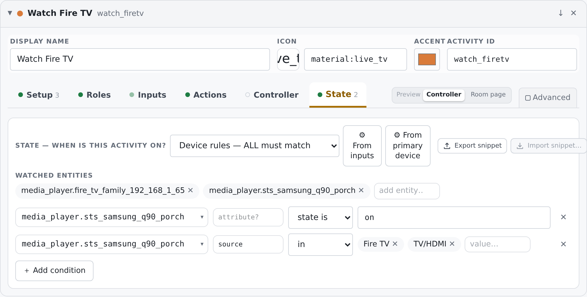

The tile's on/off truth. Four modes:

- **Implied — primary device's player (default)**: no authored
  rule. The remote derives truth *live* from the primary cast
  device's media_player — on/playing/paused/buffering/idle means
  ON. A manually powered-off device can therefore never strand a
  lit tile. The exemption: a primary marked **never off** can't
  witness anything (it's always on), so the select stays truth —
  which is why this card shows "From activity select" for a Fire
  TV-led activity.
- **Device rules — ALL must match** / **ANY may match**: authored
  conditions. Each row: entity, optional attribute, an operator
  (*state is*, *equals*, *in*, *not in*) and the value(s).
  **Watched entities** declares what the engine subscribes to for
  these rules.
- **Primary entity in any of…**: the light version — one entity, a
  list of states that mean ON.

Two generators write the rule for you: **⚙ From inputs** — display
on + source equals your Inputs answer, the classic
`watch_firetv` shape and the right call when the player itself
never sleeps; **⚙ From primary device** — primary's media_player in
any on-ish state, right for devices that genuinely power off (the
projector), wrong for never-off streamers. Both write ordinary
editable rules. State rules export/import as snippets with the
standard grammar.

## 10. Advanced

The machine view: the whole activity as it lives in the config,
JSON, applied verbatim on edit. The escape hatch when you know
exactly what you want — everything the other tabs write is visible
here.

  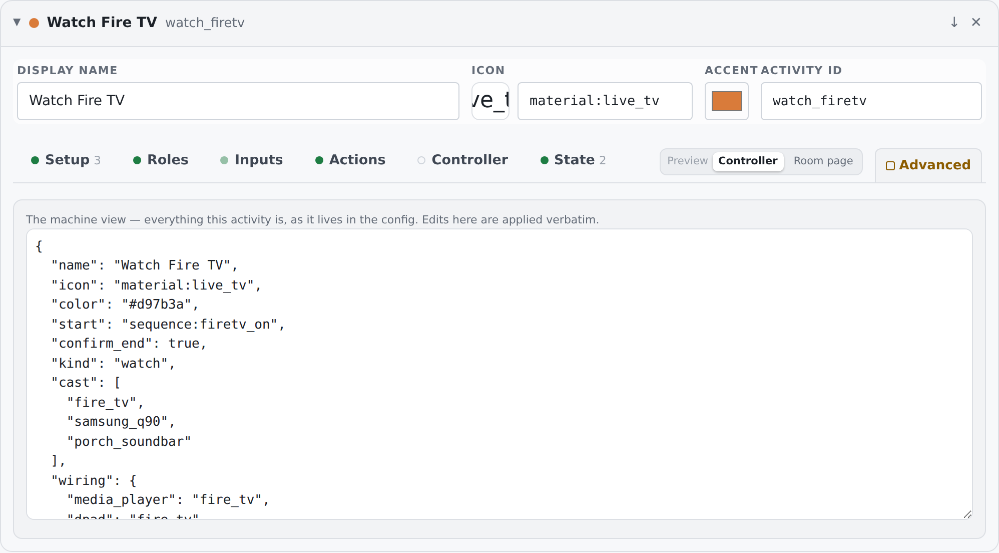

## Save, deploy, test

Everything so far is a **draft** — the preview tracks it live, the
remotes don't. **Save & Deploy** (glowing when dirty) validates,
stores, and deploys; remotes pick it up on their next reload — the
engine reads config at page load, so "reload" means refreshing the
browser tab or the kiosk app (Fully Kiosk: swipe from the left edge
→ reload, or use the Studio's ⋯ → *Save + Reload Astrion* if your
remote is wired for it). Two testing truths: the sequence editor's
**▶ Test** runs the last *saved* copy HA-side, not your draft —
save first; and the fastest full rehearsal is the preview itself,
where clicking the activity tile runs the real engine's real start
flow.

## Troubleshooting

- **A cast device holds no roles** — it's an understudy; an earlier
  cast member's claims won. Roles tab, reassign.
- **A tile I expected doesn't exist on the remote** — its role is
  consumed by the controller but unwired (the hollow dot in the
  consumed strip). Wire it, or enjoy the minimalism.
- **The tile reads OFF while the select says running** (or vice
  versa) — you're seeing implied state at work; the primary's
  media_player is the witness. Author a State rule if the implied
  witness is wrong for this hardware.
- **"Off" doesn't power anything down** — there's no stop action;
  ending an activity only flips state. Generate a Stop and check
  the devices that should die with it.
- **Generated sequence stopped updating** — you edited it, so
  regeneration writes a `_v2` beside it instead of touching yours.
  Point the activity at whichever you prefer.
- **Everything on the Inputs tab is empty** — the device is off and
  hides its source list; use *type a source…*.
- **The picker can't find my device** — Harmonium can only offer
  what Home Assistant knows. Check Settings → Devices & services on
  the HA side; once the integration is set up there, the device
  appears in the cast picker without any Harmonium configuration.
