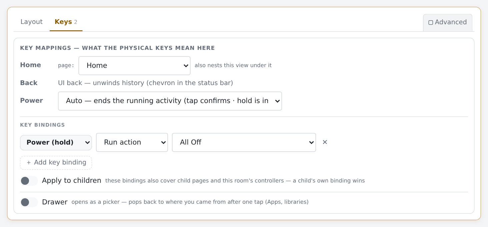

# Hardware keys

*Purpose: Making every physical button do the right thing on every page — including KeyMapper backup/restore. Audience: hardware-remote users.*

**Outcome:** every physical button on the remote does the right
thing on every page — arrows drive focus, volume is always volume,
and on a passthrough screen (Watch TV) the D-pad belongs to the
device you're watching.

## 0. The hardware side (Astrion/HA100)

Getting the buttons to *emit* something a webview can see is the
sideloading + KeyMapper story, covered start-to-finish by Brad
Sanders' community guide:
[Astrion Remote for Home Assistant — sideloading, Fully Kiosk, button
remapping](https://community.home-assistant.io/t/astrion-remote-for-home-assistant-sideloading-fully-kiosk-button-remapping-guide/1008570).

⚠️ **One step in that guide to SKIP: installing the Home Assistant
Companion app.** Harmonium doesn't need it — the Fully Kiosk
integration already provides everything (battery and charging
sensors, TTS, overlay messages, the media player) — and on our own
Astrion the Companion app held a **partial wake lock from boot**
(its persistent websocket + background sensor workers), blocking
deep sleep and bleeding the battery. If it's already installed:
`adb uninstall io.homeassistant.companion.android.minimal` — clean
and reversible. Details in the wake-lock section below.

⚠️ **One step to ADD to that guide — ON THE ASTRION ONLY:
KeyMapper's Expert Mode.** The symptom, reported by a beta user on
the HA forum (2026-08-24) and easy to lose an evening to: *"buttons
controlling only the remote rather than being mapped through the
browser."* The keys work — the launcher reacts — but they never
reach Fully's webview, so Harmonium never sees them.

> **Scope warning (2026-08-22, learned the hard way): this whole
> Expert Mode section is the ASTRION/HA100 path.** On the
> **Haptique RS90 it is absolutely NOT required and is an active
> TRAP** — its wireless-debugging re-arm causes ADB permission
> dialogs at every boot, and the RS90's keys work fine without it.
> The RS90 has its own four-layer story: see the RS90 section
> below, and `remotes/rs90/facts.md` for the runbook.

On the Astrion family, KeyMapper's ordinary accessibility service
can't reliably intercept keys inside a **browser/webview**.
**Expert Mode** (KeyMapper 4.0+, briefly called "PRO mode"; it
drives a *System Bridge* component) is what makes it work there.
Enable it in KeyMapper under Settings, which needs the
`WRITE_SECURE_SETTINGS` permission granted one of three ways:

```sh
# non-rooted, over ADB (what most people do):
adb shell pm grant io.github.sds100.keymapper android.permission.WRITE_SECURE_SETTINGS
```

or via **Shizuku** (the recommended route on Android 11+), or with
KeyMapper's root toggle on a rooted device. KeyMapper's own docs are
the authority: <https://docs.keymapper.club/user-guide/adb-permissions/>.

Two notes that save time:

- **Expert Mode needs KeyMapper 4.0 or newer.** On 3.x there is no
  such setting — check the version before hunting for the toggle.
- **A KeyMapper backup does NOT record it.** The backup JSON carries
  only `keymap_list`, `groups` and the default delays — no app
  settings — so restoring a working backup onto a fresh remote will
  *not* bring Expert Mode with it. Turn it on per device. To check
  whether the permission is actually granted:

  ```sh
  adb shell dumpsys package io.github.sds100.keymapper | grep WRITE_SECURE_SETTINGS
  ```

⚠️ **One step to ADD to that guide: check (and maybe update) the
webview.** Every Astrion carries stock **Chromium 61** (2017) as
its fallback webview; inspected units *run* a factory **Google
WebView 136** from `/system/priv-app/NWebView_x15` — whether any
retail unit really runs the 61 fallback is unproven, so check
yours. Tap **ⓘ** on the remote and read
the **WebView Chromium** row: 136+ means you're done; 61 means
sideload the current Android System WebView APK (`adb install` —
Android 8.1's provider list accepts Google's package by AOSP
default; if selection fails, `adb shell dumpsys webviewupdate`
explains why). The engine runs on 61 (our battery enforces that
syntax floor) but newer is faster and better tested. The RS90 is
the opposite case: its Android 12 locks the provider list to stock
Chromium 91 — no upgrade possible or needed; ignore Fully's nag
there.

One Harmonium-specific rule for KeyMapper: **gestures are KeyMapper's
job**. Map *hold* and *double-press* to their own distinct keycodes
there — the engine deliberately runs no gesture timers (one
exception: select's hold-capture). A "hold volume" that emits its own
keycode arrives as its own binding, cleanly.

**Which physical key emits which F-key** — Home `F1`, Power `F2`,
the F4–F7 row (lightbulb/curtains/music/climate, doubling as
REW/play-pause/stop/FWD on astrion2), and the color keys Red `F8`
Green `F9` Blue `F10` Yellow `F11` (KeyMapper app launchers on the
shipped profile — Red is the road back to Fully) — is tabled in
`remotes/astrion/facts.md`, holds included; the generated per-rule
map is `remotes/astrion/keymapper/v1/astrion-remote-map.md`.

## 0b. The hardware side (Haptique RS90) — NO Expert Mode

The RS90's key stack is a different animal, resolved 2026-08-22
after a full day of forensics. **Four independent layers, all
required** — the canonical runbook is `remotes/rs90/facts.md`
("THE RS90 KEY STACK"), the full investigation (including the
device-id theory that failed) is `remotes/rs90/key-research.md`,
and the restorable mapping set is `remotes/rs90/keymapper/`:

1. **The launcher must NOT be cantata.** The stock
   `com.cantata.remote` is both remote UI and home app, and as home
   it grabs the physical keys at boot — every mapped key dead.
   Install a dumb launcher (**KISS Launcher**, FOSS via Aurora),
   set it Home → Always; cantata stays installed, launched on
   demand from a dot key.
2. **KeyMapper via the INPUT-METHOD path — never Expert Mode.**
   Accessibility service on; **enable AND select the Key Mapper
   keyboard** (that's the injection path); tick *auto-switch to
   normal keyboard when typing*; grant DND access once
   (`adb shell cmd notification allow_dnd io.github.sds100.keymapper`)
   — without it the volume/mute triad specifically stays dead.
3. **The boot IME-injection race is the reboot-killer.** After a
   reboot, KeyMapper's log shows capture/consume/inject all
   succeeding while nothing reaches the webview: the KeyMapper IME
   was selected before the input pipeline was ready. The fix is
   re-selecting the IME once (bounce to LatinIME and back). NOT the
   device-id known-issue — that theory was tested and failed.
4. **`com.skavan.imefix` automates the bounce** (`tools/ime-fix/`,
   our own APK; source + build + grant steps in its README). Fully's
   *Application to Run on Start in Foreground (PLUS)* launches it;
   it waits ~5 s, flips `default_input_method` to LatinIME and back,
   then kills itself. One-shot, no service, no root; needs
   `WRITE_SECURE_SETTINGS` granted once via adb. (Termux cannot do
   this without root — tested.)

Two masks that cost hours, so you don't re-pay them: with injection
dead, keys flow raw into Fully, whose Astrion-imported
`disableVolumeButtons: true` swallows volume — "volume does nothing"
can be two configs interlocking, not a second thief. And the RS90's
**Power=F1 / Home=F2 are SWAPPED vs the Astrion** — never copy the
Astrion's keymap or its KeyMapper zip; use
`remotes/rs90/keymapper/key_mapper.zip` (remotes/push-keymapper.bat takes
the folder name).

**Long-press Home and Power (v0.85.7+).** The RS90 engine keymap
speaks the same hold language as the Astrion family: `=` (and `;`)
→ `home_hold`, `]` → `back_hold`, **`F12` → `power_hold`** (`o`/`O`
remain as desktop-browser conveniences only — a letter can land in
a text field, so remotes emit the untypeable F12 instead). In
KeyMapper (FullyKiosk group) wire the long-presses accordingly:
**Home** (`KEYCODE_F2`, 132) long-press → `=` (`KEYCODE_EQUALS`,
70), and — for long-press Power = All Off, which used to ride `=` —
**Power** (`KEYCODE_F1`, 131) long-press → **`KEYCODE_F12` (142)**.
Same on the Astrion family in Expert Mode: Power long-press → F12
(the Astrion's Power short is F2, Home short is F1 — mirrored vs
the RS90). After changing mappings, re-export the backup and
refresh `key_mapper.zip` + `data.json` so `gen-map-docs.py`
regenerates `rs90-remote-map.md`.

## Wake locks eat the battery (measure first — and a brick warning)

A remote that never deep-sleeps bleeds battery no matter what the
kiosk does. The cause is a **partial wake lock** held by some app —
and the right fix depends entirely on *which* app, so measure
before touching anything. Two commands tell the whole story:

    adb shell dumpsys power | findstr /i "wake"

A healthy idle remote shows no long-lived `PARTIAL_WAKE_LOCK`. If
one is there (`ACQ=-12h…` means held for twelve hours), note the
`uid=` and name the owner:

    adb shell pm list packages -U | findstr <uid>

**Culprits seen in the wild, and their remedies:**

- **The Home Assistant Companion app** (found on our own Astrion:
  `WorkManager: ProcessorForegroundLck`, held since boot). The
  minimal build keeps a persistent websocket + background sensor
  workers alive. Harmonium doesn't need it — the Fully Kiosk
  integration already supplies the battery/plugged sensors, TTS,
  overlay and media player — so if nothing else uses it:
  `adb uninstall io.homeassistant.companion.android.minimal`
  (clean, reversible). To keep it instead, turn off its persistent
  connection and background sensors in the app's own settings.
- **The stock HaRemote launcher** (documented by
  [marcusadolfsson/astrion-custom](https://github.com/marcusadolfsson/astrion-custom),
  README §4: one unbroken 68-hour hold). Android starts the HOME
  app at boot even though Fully autostarts over it. The remedy is
  making Fully the home app — note plain
  `set-home-activity de.ozerov.fully/.MainActivity` is **rejected**
  ("cannot be home"): Fully only registers a home-capable activity
  through its own launcher/kiosk-mode setting, so enable that in
  Fully first, and mind that kiosk mode also gates app switching
  (whitelist your KeyMapper app-launch keys). Before changing
  anything, **record your current home component** — it varies by
  firmware (`boot.RemoteApp` on some units,
  `.ui.set.about.navigtion.WelcomeActivity` on others) and that
  exact string is your only revert path:

      adb shell cmd package resolve-activity --brief -a android.intent.action.MAIN -c android.intent.category.HOME

⚠️ **Never `pm disable` the stock HaRemote app.** `pm disable-user
com.aiks.HaRemote` **bootloops the HA100** — no safe mode, no
recovery, no factory reset; the only way back is BROM/preloader
flashing with vendor firmware, and at least one owner has bricked
a unit this way. (Uninstalling a normal *sideloaded* app like the
companion app is fine — the brick risk is specific to the stock
launcher.) Opening HaRemote on demand (a KeyMapper app-launch key)
is always fine; anything it holds clears at the next reboot.

After any remedy, re-run the `dumpsys power` check: the
long-lived lock should be gone and
`mHoldingWakeLockSuspendBlocker` should read `false` when idle.

For a controlled 24–48 hour discharge test, use
`remotes\battery-mon-start.bat` when the charged remote comes off external
power, then `remotes\battery-mon-report.bat` at the end. The pair preserves
Android batterystats and full wake-lock history, final process/CPU snapshots,
package-to-UID mappings, and a Battery Historian bugreport under the
gitignored `remotes\battery-runs\` folder.

## 1. See what the buttons send

On the device: **hold ⓘ** (or navigate to `keys:`) — the key-capture
screen. Press every physical button and note what arrives
(`event.key` / keycode). This is ground truth; vendor firmwares remap
freely.

## 2. Bind them

*System → Remotes & keymaps* in the Studio. Each remote profile
declares its **capabilities** (`physical_dpad`, `touch`, `pointer`,
Fully yes/no) and its **keymap**: physical key → logical button
(`up`, `down`, `select`, `back`, `home`, `vol_up`, `menu`,
`red`/`green`/`blue`/`yellow`, …).

Bind the *logical* names once; what those logical buttons do is
policy, decided per page class:

- **Room pages**: arrows move focus, select activates, Home goes to
  the home screen, Power offers All Off (confirmed).
- **Controller pages (activity running)**: arrows + select pass
  through to the wired `dpad` device; back/home/menu follow the
  activity's controls; volume drives the wired volume target.
- **Everywhere**: bindings can be per-page (page buttons), global
  (`global.buttons`), or hold-variants (`menu_hold` etc. — fed by
  KeyMapper's distinct keycodes). Volume needs NO binding at all:
  unbound `vol_up`/`vol_down` route to the running activity's wired
  volume (the Volume role) by default, like mute always has — a
  `buttons` entry still wins when you want something else.



**The pad doctrine** (one sentence): *the D-pad drives whichever
screen you're navigating — and OK always means the focused thing.*

In full: **the pad drives whichever screen you're navigating.** A
page that declares a device navigation target — Watch TV, a
receiver's on-screen menu — sends all five nav keys to that device,
and **CH▲/CH▼ walk the LCD instead** (▲ = up): the moment you
press CH there, the panel borrows the *whole pad* — a thin pulsing
strip appears at the bottom edge, and every press renews a rolling
8-second window (tune it: `input.pad_latch_seconds` on the Input
policy slice's Code tab) during which the arrows and OK serve the
highlight. Stop, and the pad quietly returns; Back, a touch, or
navigating away hands it back immediately.

Every *other* page — rooms, details, and **music** — the pad walks
the LCD natively, and **OK always means the focused tile**:
play/pause on the now-playing hero, mute on a volume row, fire on
a preset. No mode, no strip. What ◀▶ and OK mean on the focused
tile is its **nav mode** — see the table below.
The music conveniences live on keys
the panel doesn't need: **hold-◀/hold-▶ seek −15 s/+15 s**,
**hold-CH▲/CH▼ skip to the previous/next track**, **short CH jumps
sections** (the category strip in the library, the section tabs —
and simply walks on a page with nothing to jump), and **menu opens
the Music Library** (a stock binding on the music page). Which UI
the pad drives is the page author's choice: declare the navigation
target and the pad passes through with CH as the walk; leave it
undeclared and the pad walks the LCD, with the device's occasional
menu key on a tile or the `menu` binding.

All the names involved
(`ch_up`/`ch_down`/`ch_up_hold`/`ch_down_hold`/`left_hold`/
`right_hold`; the holds arrive as `'` `/` `,` `.`) are ordinary
logical buttons a page can rebind in *Page settings → Keys* — the
stock TV screen, for instance, points `left_hold`/`right_hold` at
the device's REWIND/FAST_FORWARD. Like every hold, the hold
gesture is the shell's job: see the KeyMapper recipes below.

**The four nav modes** — what ◀▶ and OK mean ON a focused tile is
the tile's *nav mode*, declared by its widget and overridable per
tile in config (`"nav": "action" | "value" | "options"`):

| Mode | ◀ / ▶ | OK | Who ships it |
|---|---|---|---|
| **action** | walk | fire the tile | presets, devices, activities (the default) |
| **value** | adjust the value | the secondary (mute, toggle, join) | volume, every stepper, light, fan, climate, speaker-group rows |
| **options** | rove a highlight through the choices | commit the highlighted one | chips rows (HVAC/fan/preset), transport, cover buttons |
| **capture** | — | grab the whole pad | dpad/passthrough tiles only |

▲/▼ **always walk** — no widget owns the vertical axis anymore.
On an options row the highlight starts at the active choice and
drops when you walk away without committing. The old select-capture
("OK grabs, ▲▼ adjust") survives only on tiles that genuinely
forward keys to another device; light and fan also keep their
optional hold-OK grab.

**The Speaker Group page** is these modes in action: every player
is a real tile (▲▼/CH walk them) — ◀▶ and the on-screen −/+ trim
*that* player, OK toggles it in or out of the group (the master
row's OK does nothing — its level is the activity's volume band),
and the **Group Volume** tile moves every volume-linked member
while preserving their offsets, with OK (or its link-off icon) as
**ungroup-all**. The hardware VOL/Mute keys deliberately stay on
the activity's audio path everywhere — the ARC lesson holds.

Which profile a device uses: the `#device=<profile>` pin in its
Start URL (keep the pin in the configured URL — GETTING-STARTED §4
has the why) or the stored provisioned name — check it on the ⓘ
page ("Profile 'astrion'").

## 3. Verify without leaving the desk

With [the device photo](device-photo-skin.md) on, the Studio preview
washes every key that does something on the current page — and the
tooltip on each key spells out its exact binding, hold included.
Click a key in the photo and the preview engine receives it for
real. Walk your pages in the *Showing* strip and watch the washes
change; that's the whole keymap audited in a minute.

## Troubleshooting

- **A button does nothing anywhere** — it isn't in the profile's
  keymap, or the firmware swallows it (check `keys:` capture first;
  if nothing arrives there, it's KeyMapper/firmware territory).
- **Arrows scroll the page instead of moving focus** — the profile
  is missing `physical_dpad`, so the engine is treating the device
  as touch-first.
- **Volume drives the wrong thing during an activity** — that's the
  activity's wiring, not the keymap: fix the `volume` role in the
  activity's Roles tab.


## Backing up KeyMapper (the wiring is half the remote)

Everything above assumes KeyMapper is configured on the device — and
until now that configuration lived ONLY there. Two repo scripts make
it travel with the code. Both use the repo's own adb (`tools/adb/` —
three files committed once from any scrcpy or platform-tools folder,
see the README there), so a fresh clone runs them with zero setup.
Plug the remote in over **USB** (the same connection it was
provisioned with) and:

- **`remotes/pull-keymapper.bat`** — no arguments needed. One-time setup on
  the remote first (KeyMapper offers no headless export intent):
  KeyMapper → **Settings → Change automatic backup location →
  Change** → save `key_mapper.zip` into **Download**. From then on
  KeyMapper rewrites that backup on every mapping change, so the
  device copy is always current — no manual export step, ever.
  (Don't bother with ⋮ → *Export all*: on the Astrion the share
  sheet offers no save-to-files target, so it jumps straight to the
  Bluetooth picker.) The script pulls the **newest** `*key*.zip`
  from Download into `remotes/astrion/keymapper/v1/key_mapper.zip`
  (pass a name for a different folder). Commit the zip. Quirk: the
  save dialog suffixes `(2)`/`(3)` instead of overwriting and can't
  delete its own pileup — the script always takes the newest and
  names it cleanly; tidy Download with the remote's File Manager
  when the dupes bother you.
- **`remotes/push-keymapper.bat`** — provisioning a NEW remote: pushes the
  newest committed zip into the device's Download folder, verifies
  it landed, and opens KeyMapper; finish with **⋮ → Restore** and
  pick the file. Two taps instead of re-authoring every key.

ADB-over-wifi also works — pass the remote's IP as the first
argument — but USB is the normal path. Direct access to KeyMapper's
data directory needs root, so export-then-pull is the honest
portable flow.

## The glyph row (F4–F7): two hardware generations

The four buttons at the bottom of the Astrion's face emit `F4`–`F7`
— and F-keys reach the webview raw, so these need NO KeyMapper
mapping at all. What's *printed* on them depends on which unit you
own, and Harmonium ships a profile for each:

- **Original faceplate** (💡 lightbulb, curtains, ♪ music,
  climate): the **`astrion`** profile names them `light` / `cover`
  / `music` / `climate`, matching the device-photo skin's hotspots
  (which light up the moment the keys are named).
- **The 2026 revision** (⏮ · ⏯ · ⏹ · ⏭ — same keycodes, new
  glyphs): the **`astrion2`** profile names them `prev` /
  `play_pause` / `stop` / `next`, and those four need **no
  bindings at all** — the engine drives the running activity's
  media player with them from ANY page (room, library, wherever),
  because a dedicated transport key should just work. The v2
  faceplate has its own device-photo skin (`astrion2.png`) with
  hotspots for every key — wheel quadrants included.

On your own remote, the Key capture screen (hold ⓘ → Key capture)
writes the same entries in four presses.

What they DO is yours to bind in **Page settings → Keys** — the
binding dropdown offers every custom button your remote profiles
emit (v0.83.11), alongside the fixed set. The natural defaults:
`music` → navigate to the Music Library page; `light`/`cover`/
`climate` → navigate to a domain page, fire a scene, or open a
device's detail page (`detail:<entity>` is a valid navigate target).
Unbound keys simply do nothing — bind what the house actually uses.

**Apply to children** (same panel): a room page that switches it on
offers its bindings to everything under it — child pages via their
parent chain, and the controllers its activities land on — so
binding the glyph row once on Porch covers the whole Porch world.
A child's own binding always wins; `global.buttons` sits underneath
everything.

## Back/Home OUTSIDE Harmonium (don't get stranded)

The Astrion's physical Back and Home keys emit `[` and `]` — which
Android itself doesn't understand. Inside the kiosk the engine
translates them; anywhere else (the Android UI, an app you F-keyed
into, or Fully's own settings sheet pulled up OVER the kiosk) they
do nothing, and there is no visible way back.

The escape hatch lives in KeyMapper, which is already intercepting
every key: two mappings — trigger = the Back key with
**long-press**, action = *Go back*; trigger = the Home key with
long-press, action = *Go home* — each with the constraint **Fully
Kiosk Browser in foreground**. Long-press matters: a plain
(short-press) remap would swallow `[`/`]` before the engine ever
sees them and break Back/Home inside Harmonium; long-press triggers
leave short presses flowing through untouched. The constraint
matters too: scope ONLY these two to Fully — the app-launcher
F-keys stay global, because they're the way back to Fully from any
other app you land in.

What this replaced (decided 2026-08-17): those long-presses used to
emit `]`/`;` — harmonium's `back_hold`/`home_hold`, which forward
the DEVICE's back/home to the control target. That was redundant on
controller screens (short back/home already pass through) and its
unique value — device back/home from a hub page — wasn't worth
being stranded in Fully's settings for. Retired on the Astrion:
the stale keymap entries are gone from the starter config (clean
your live config's astrion profile in the Studio if you care — the
entries are inert either way), the engine keeps the mechanism (the
default profile's `{`/`}` still speak it, and long-press Power
`=` → `power_hold` → All Off is untouched), and
`astrion-remote-map.md` documents the new rows. After changing
mappings, run `remotes/pull-keymapper.bat` so the backup zip carries them.

## Optional: device Back/Home on long-press

Want **long-press Back/Home to reach the device** — Home on the
Fire TV from anywhere? The engine has always spoken it
(`back_hold`/`home_hold` forward the device's own Back/Home via the
activity's navigation target, degrading to a plain tap on pages
without one); only the *gesture* is unmapped on the stock Astrion
profile, because those long-presses currently do something more
important: they're the **escape hatch** (Android *Go back* / *Go
home*) that rescues you when Fully's settings sheet or the Android
UI swallows the remote — see the section above on not getting
stranded.

If device-keys matter more to you than the escape hatch, it's two
KeyMapper edits: change the **Back long-press** action from *Go
back* to *Key code* → `KEYCODE_LEFT_CURLY_BRACKET` (`{` →
`back_hold`), and **Home long-press** from *Go home* to *Key code*
→ `KEYCODE_RIGHT_CURLY_BRACKET` (`}` → `home_hold`), keeping the
*Fully in foreground* constraint. Keep at least one escape route:
move *Go back*/*Go home* to **double-press** triggers, or accept
that a stranded session needs adb. After changing,
`remotes/pull-keymapper.bat`.

## Hold-CH and hold-◀/▶ in KeyMapper (four more mappings)

Same pattern as the long-presses above, same reasons — four
mappings, all with the **Fully Kiosk Browser in foreground**
constraint, all *Key code* actions on a **long-press** trigger:

| Trigger (long-press) | Key code to send | Arrives as | Engine meaning |
|---|---|---|---|
| Channel Up | `KEYCODE_APOSTROPHE` | `'` | `ch_up_hold` — previous track (music) · big jump up (elsewhere) |
| Channel Down | `KEYCODE_SLASH` | `/` | `ch_down_hold` — next track (music) · big jump down (elsewhere) |
| D-pad Left | `KEYCODE_COMMA` | `,` | `left_hold` — seek −15 s (music) |
| D-pad Right | `KEYCODE_PERIOD` | `.` | `right_hold` — seek +15 s (music) |

(On the Astrion the CH buttons emit
`KEYCODE_PAGE_UP`/`KEYCODE_PAGE_DOWN` and the pad arrows emit
`KEYCODE_DPAD_LEFT`/`KEYCODE_DPAD_RIGHT` — those are the triggers
to pick.) The engine maps all four keys in every profile that
doesn't claim them for something else — older configs whose
profiles predate the holds get them automatically. Short presses
keep flowing through untouched (PageUp/PageDown → the section
jump/walk, the arrows → the focus walk). On a page with its own
`left_hold`/`right_hold` binding, the binding wins — the stock TV
screen uses exactly that for REWIND/FAST_FORWARD. After adding the
mappings, `remotes/pull-keymapper.bat`.
