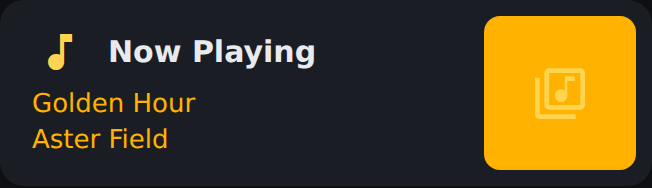
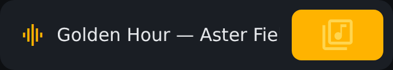
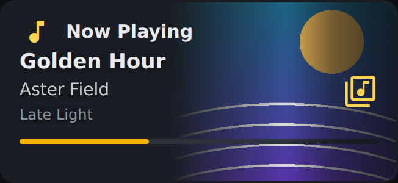
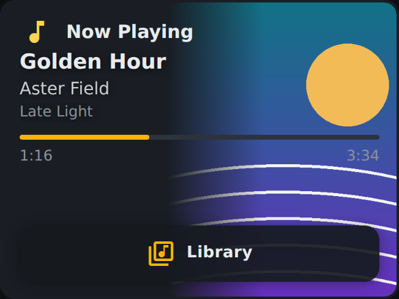
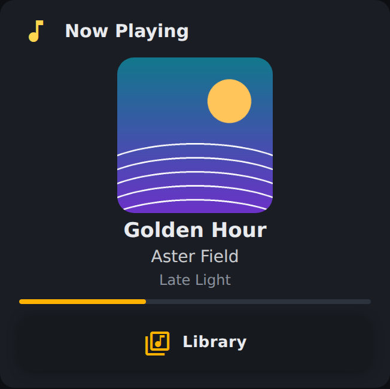

# The Now Playing cards — pick your style

Every activity gets to choose how its Now Playing card draws. This is probably the single biggest visual difference between two Harmonium setups, and the picker is easy to miss — so here is the whole family, at real remote size.

**Where to set it:** Studio → your activity → **Controller** tab → the *Now Playing* row's style picker. The choice is per-activity: Watch TV can run a compact card while Listen to Music runs the big art hero, on the same remote. (Per-card override for hand-built pages: `"style": "<value>"` on a `media` tile in Advanced/JSON.)

**The default:** the stock Music and TV controllers both ship **Art Hero** (`np_default: "hero"`). That's a *default*, not a lock — the stock tile deliberately leaves the `style` slot empty so your picker choice always wins. Untouched stock controllers pick this default up automatically on update; a controller you've edited is your copy and keeps whatever you chose.

Every Art Hero variant holds a fixed height, so the tiles below the card never move when artwork or track length changes.

## Basic (`plain`)

The flat card: state, title and artist, no artwork. For controllers where music is one tile among many.

## Slim row (`slim`)

One line — a playing indicator and "Title — Artist". For pages where music is background: a TV controller, a room hub.

## Art Hero — Compact (`art`)

The artwork hero at its shortest: art behind the right panel, title/artist/album and the live progress bar in front.

## Art Hero (`hero`) — the shipped default

The full hero: artwork panel, three text lines, elapsed/total readout, and the Library door along the bottom.

## Art Hero — Large (`poster`)

The poster: artwork as a centered square with the text stacked beneath — the card is the page. For music-first rooms and wall tablets.

## Auto, and the legacy wash

**Auto** (the empty value) defers to the tile — which on the stock controllers means Art Hero. **Art wash** is the legacy full-bleed style (dimmed artwork under the whole card); configs that use it keep working and keep their picker entry, but it's retired from the menu for new picks.

## Where did the transport bar go?

The **RS90 and the Astrion "v2" profile have physical transport keys** (REW / Play-Pause / FWD / Stop live on the remote itself), and those profiles declare `physical_transport` — so the stock music controller **drops the on-screen transport bar from the LCD** on those remotes. Nothing is missing: the real buttons drive the same player, and the screen space goes to the card and the queue. The classic Astrion profile (domain-shortcut labels on F4–F7) keeps the on-screen bar. The same rule hides the on-screen Back/Home row on remotes declaring `physical_back_home`.

## Related

- Which profile a remote wears, and its keys: `hardware-keys.md`, `../../remotes/astrion/facts.md`, `../../remotes/rs90/facts.md`
- The band system (which rows show at all, per activity): the Controller tab's per-band Auto/Off switches
