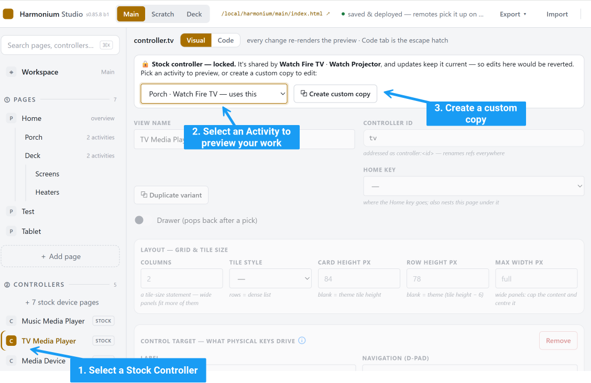
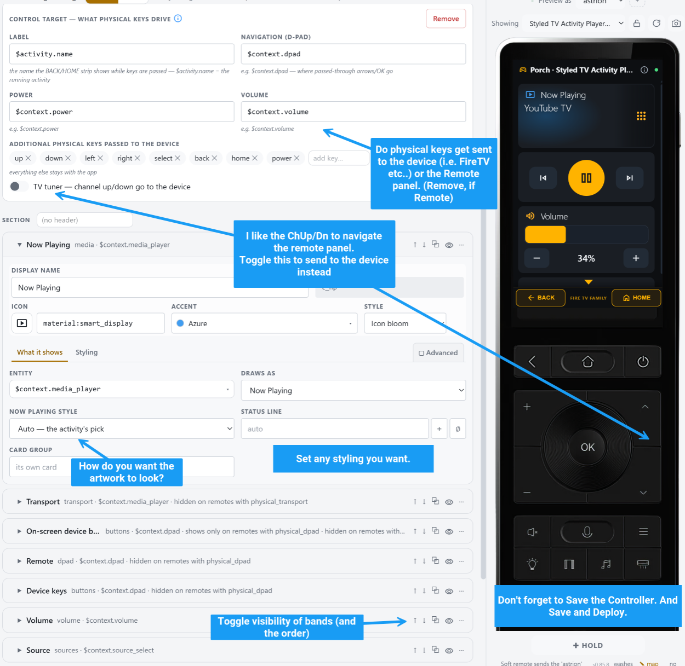
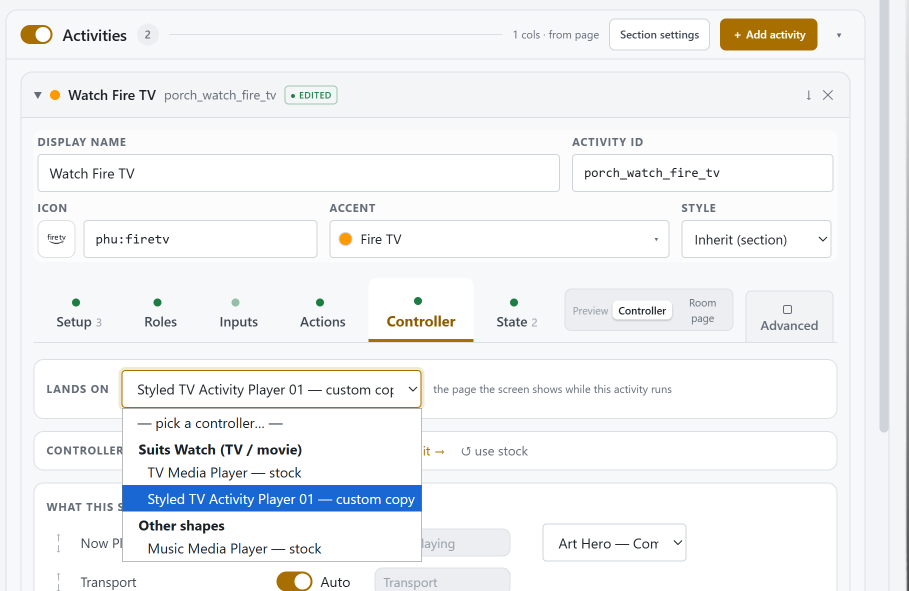

## Clone a stock controller to customize it

##   
Customize your Controller

### Note - a Controller is normally a template ($context.power, $context.volume in an activity template, derived from the roles in the activity, or $device if its a device template).

## Select your newly created controller!

