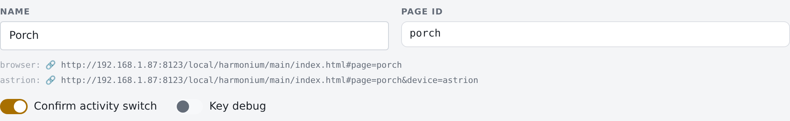

# Harmonium v0.85.7

The biggest release since the beta opened. Three themes: **your config is now protected by a real ownership system** (updates can never again strand you on old built-ins *or* overwrite your changes), **the physical keys now do exactly what the routing doc says** (several long-press bugs among them), and **the Music Library got a full redesign**. Around them: a new styling stack, deep links, a rebuilt ⓘ page, and a permanent fix for the "my remote is running an old version" class of bug.

## ⚠ Upgrading — four steps

1. **Export your config first** (Studio → Export) and keep the file. It's your safety net: Studio → Import puts everything back exactly as it was, and if you report a problem it's what lets us reproduce it (and if you need it, we can fix it for you).
2. **Restart Home Assistant** after the HACS update — the integration's Python changed (new service option, new API endpoint).
3. **Open the Studio and press Save & Deploy.** Updates to built-ins apply when you save.
4. **One last cache clear, then it maintains itself.** If the remote's ⓘ page shows an engine older than 0.85.7, on the Fully device page in HA press **Clear browser cache**, then **Load Start URL** ([the two buttons](../images/fully-ha-buttons.png)). Then set Fully's Start URL **from the Studio**: open the page the remote should boot to (usually your home page) and click the second link under its Name — the one that ends `&device=<profile>` — to copy the complete address:

   

   That address re-checks the engine version on every boot, and from this release the engine also checks for a newer deployed version whenever it reconnects or wakes and reloads itself — so updates reach long-running kiosks on their own. If a remote ever seems stuck anyway, the failsafe is those same two Fully buttons: **Clear browser cache**, then **Load Start URL**. The remote's ⓘ page shows the address the device is *currently* using (the "This page" row) — compare it against the Studio's link to confirm the remote is pointed at the right place.

## ⚠ Breaking changes

Three things change real behavior. The first needs your hands on the remote; the other two arrive on their own.

**1. The hold-gesture keys moved — hardware remotes need their Key Mapper rules updated (action required).**

The engine's hold vocabulary is now: `]` = hold-Back, `=` = hold-Home, `F12` = hold-Power (All Off). The pre-0.85.7 profiles sent `=` for hold-*Power* — so on a remote still carrying the old rules, hold-Power goes *Home* instead of All Off, and hold-Home does nothing.

Fix it in the **Key Mapper** app on the remote. The output keys are identical on both remotes; the **trigger keys are mirrored** (Astrion: Home=F1, Power=F2 · RS90: Power=F1, Home=F2) — never copy one remote's rules to the other:

| Rule | Astrion trigger | RS90 trigger | Output key |
|---|---|---|---|
| Hold-Back | Back, long-press | Back, long-press | `]` — `KEYCODE_RIGHT_BRACKET` (72) |
| Hold-Home | `F1`, long-press | `F2`, long-press | `=` — `KEYCODE_EQUALS` (70) |
| Hold-Power | `F2`, long-press | `F1`, long-press | `F12` — `KEYCODE_F12` (142) |

Or skip the hand-editing and restore our ready-made profile: copy `remotes/keymapper/<remote>/key_mapper.zip` to the remote (adb push, or download it in the remote's browser), then in Key Mapper: **⋮ menu → Restore** and pick the file. It contains the complete mapping, these three rules included.

The full rule-by-rule maps: [Astrion key map](https://github.com/skavan/harmonium/blob/main/remotes/keymapper/astrion/astrion-remote-map.md) · [RS90 key map](https://github.com/skavan/harmonium/blob/main/remotes/keymapper/rs90/rs90-remote-map.md) · setup runbook: `docs/cookbook/hardware-keys.md`.

**Check your work:** turn on *Key debug* (Studio → your home page → Key debug switch), then hold Back, Home and Power on the remote — the debug card on the remote should print `]`, `=` and `F12`. Turn the switch off when done.

The Harmonium-side keymaps heal automatically (if you never edited them); the rules on the device itself are the one part no update can reach.

**2. Tap vs hold flipped for Back/Home on TV pages.** The doctrine is now: *tap* Back/Home drive the device (i.e. FireTV, AppleTV) on TV pages (and Harmonium everywhere else); *hold* Back/Home always drive Harmonium. The old policy sent the holds to the device. Heals automatically unless you edited the input policy — nothing to configure, but the reversal takes a day of getting used to.

**3. The on-screen transport row is removed from remotes with real transport keys.** The astrion2 and rs90 profiles declare `physical_transport`, so the stock music controller hides its transport bar there — not missing: the physical REW/Play-Pause/FWD buttons do that job, and the screen space goes to the Now Playing card and queue.

## Your config is yours now

Every part of an install is now formally one of three things: ours (stock — updates refresh it), yours (your pages, activities, photos, remapped keys — no update may ever touch them), or *started as ours but editable* — and that last group is judged by **content fingerprint** against every shape we have ever shipped:

- A built-in you never touched silently heals to the newest version. New stock apps, fixed layouts, new capabilities, new key maps — they just arrive. Expect some visual updates from this: the stock TV page's Now Playing becomes the art hero, and the back/home strip and transport row now show or hide by remote profile.
- A built-in you edited **becomes your copy, formally**. The Studio shows *"Your edited copy, preserved."*, it unlocks for editing, and **↺ Reset to built-in** returns current stock any time. Nothing you wrote is ever thrown away.
- Device dialects (Fire TV, Google TV, Samsung, Apple TV) work the same way: untouched dialects track ours wholesale (new apps arrive), edited ones are yours — with **View stock** in the Apps editor to copy across whatever you want.
- Remote keymaps and the input policy: un-remapped/unedited copies refresh (that's how this release's key fixes reach you automatically); change even one key and the whole unit is yours.

## The keys, finally consistent (sort of)

- **The navigation doctrine is enforced everywhere** (`docs/HARMONIUM-INPUT-ROUTING.md`): tap Back/Home go to the *device* on TV pages and to *Harmonium* everywhere else; **long-press Back/Home always go to Harmonium**. Installs still carrying the older policy (long-press went to the device) heal automatically — unless you edited it, in which case it's yours or manually reverted to stock.
- **Does this model feel right to you?** We want opinions on the targeting approach — D-pad/Back/Home drive the on-screen remote everywhere except TV pages, where taps drive the television. Join the discussion: [issue #5](https://github.com/skavan/harmonium/issues/5).
- **Long-press Home was toggling the TV.** The stock Astrion keymap had the long-press-Home key wired to *hold-Power* (end/restart the activity). Fixed across astrion, astrion2 and rs90: `=` is long-press Home, `]` is long-press Back, `F12` is long-press Power (All Off) — chosen because no physical key emits F12 and it can't be typed into a text field. Update your device rules per the Breaking-changes section above.
- **Long-press Back reloaded the page on the Astrion.** A long-press that slips past the shell's mapping arrives as native Android Back and the webview unloads. The engine now traps it — a stray native Back behaves as a normal Harmonium Back; the page never unloads.
- **Ch▲/Ch▼ jump sections on every page** that has them (walk tile-by-tile where there are none; still the panel walk on TV pages), with proper breathing room above the jumped-to section.
- **Menu opens the focused tile's own page** — a nav card's target, a device's detail page, an activity's controller; deliberately nothing otherwise. A menu binding still wins.
- **The device-keys strip works from the D-pad.** The info / menu / back / home row was touch-only; it now roves like the transport row — ◀▶ move the highlight, OK presses, ▲▼ move on. And ▲▼ never snag on corner ▶ badges anymore.
- **Hold keys are bindable**: `back_hold`/`home_hold` accept page or workspace bindings like every other key.
- **The vanishing power button**: reopening a browser mid-activity showed the card lit but no End button. The engine now falls back to device truth when the routing select is stale — exactly one activity provably running → the button shows.

## Start activities from outside Harmonium

Wall switches, dashboards and automations can now start an activity properly — the routing *and* the activity's Start action — with one service call (the item promised in the 0.85.6 notes):

```yaml
service: harmonium.set_activity
data:
  activity: listen_to_music
  start: true
```

`start: true` runs the activity's Start action after flipping the routing select; leave it off and the call only flips routing (the old behavior, unchanged for existing callers). The owning room and workspace are found automatically. To end things: `activity: "off"` with `start: true` runs the running activity's Stop action first — add `room: porch` to end one room instead of the whole workspace.

## The Music Library, redesigned

- **Grid views are art-forward**: the artwork *is* the tile — reserved at its full square size from the first paint (no more collapsed tiles while art loads), name under it (two lines when needed), a service-colored dot (Spotify green, Deezer purple).
- **List view is a real list**: compact rows (roughly seven per screen instead of four), square 48px art, bold title, a "Spotify · Playlist" line, a colored source bar, a › on rows that drill. The queue got the same compaction and the same square art.
- **The D-pad reaches the top rows**: ▲ from the first item climbs into the category chips, ▲ again to Favorites / Music Library / Search; ◀▶ walk the row, OK presses, ▼ drops back to the first tile.
- Fixed: the library could stick on "Loading library…" until a manual refresh if it raced the connection at boot.

## Studio upgrades

- **The preview always runs the deployed engine now.** It used to load through the browser's HTTP cache and could show — and behave like — an old engine indefinitely (the "Studio says 0.85.6 but the preview says 0.84.1" report). It now version-checks the same way the kiosk address does. The key-debug card also no longer turns itself on in the preview from a leftover browser flag — in the preview it follows the page's Key debug switch only.
- **Pages are a tree** in the sidebar — children indent under their parent; the "hub" jargon is gone.
- **Startup & Home** (boot view, Home's final stop, view paging order) lives at the top of the Workspace view — said once, workspace-wide.
- **Every page shows its direct links**, click-to-copy, under its Name: a `browser:` line (`#page=…`) and — when the preview is *Showing* a specific remote — a second line with `&device=<profile>`: a kiosk's complete configured URL, shown in full and copyable on a plain-http Studio. Deep links are bookmarkable and affect that load only.
- **Styling, per tile and per section**: card height, label position on photo cards (nine positions, default *inherit*), photo opacity (the hero's knob, on photo cards and whole sections), and raw CSS variables (font size, weight, drop shadows) — each settable on a single card or once on a section, per-card always winning.
- **Pick your Now Playing card** — probably the #1 look-and-feel decision, now with a picture menu: [docs/cookbook/now-playing-styles.md](../cookbook/now-playing-styles.md) shows all five styles (Basic · Slim row · Art Hero Compact/regular/Large) at real remote size, per activity, with Art Hero as the shipped default.
- Photo nav cards authored in the Studio had quietly lost their "auto" smarts (borrowing the target page's banner photo). Restored.

## Also in this release

- **The engine updates itself.** A running remote checks the deployed engine version whenever its connection comes back or the screen wakes, and reloads through the versioned address when a newer engine has been deployed — Save & Deploy in the Studio now reaches every long-running kiosk without touching it. (Failsafe if one ever sticks: Fully's *Clear browser cache* + *Load Start URL* buttons in HA.)
- The ⓘ page leads with what you need: **this remote's IP** (with the Fully remote-admin address), **the exact URL this device should boot** (with its `#device=` pin), viewport and webview facts — key map moved to the bottom, bigger ⓘ tap target.
- **While we're at it: turn on Remote Administration in Fully** (Settings → Remote Administration → enable, set a password). You can then manage every Fully setting from a desktop browser at `http://<remote-ip>:2323` — the remote's IP is right there on the ⓘ page — and it's what gives HA's Fully Kiosk integration the *Clear browser cache* / *Load Start URL* buttons this page keeps mentioning.
- The integration answers `/api/harmonium/whoami` so a remote can learn its own LAN address.
- Docs: the RS90 hardware-keys runbook corrected (no Expert Mode on the RS90 — that's an Astrion thing), Fully swipe behavior documented, kiosk addresses and deep links in GETTING-STARTED.

## Known, and next

- An edited stock dialect no longer receives new stock apps (by design — **View stock** is the copy-paste door).
- A ⧉ duplicate whose built-in source has since moved on, gets no "source updated — compare?" notice yet; designed, not built.
- RS90 owners who built from our KeyMapper profile: re-check the long-press rules against the Breaking-changes section — the old profile sent `=` for long-press *Power*, and the RS90's F1/F2 are the mirror of the Astrion's.

*If anything looks wrong after updating, Studio → Import your exported file puts you back, and a GitHub issue with that file attached gets it fixed properly.*
