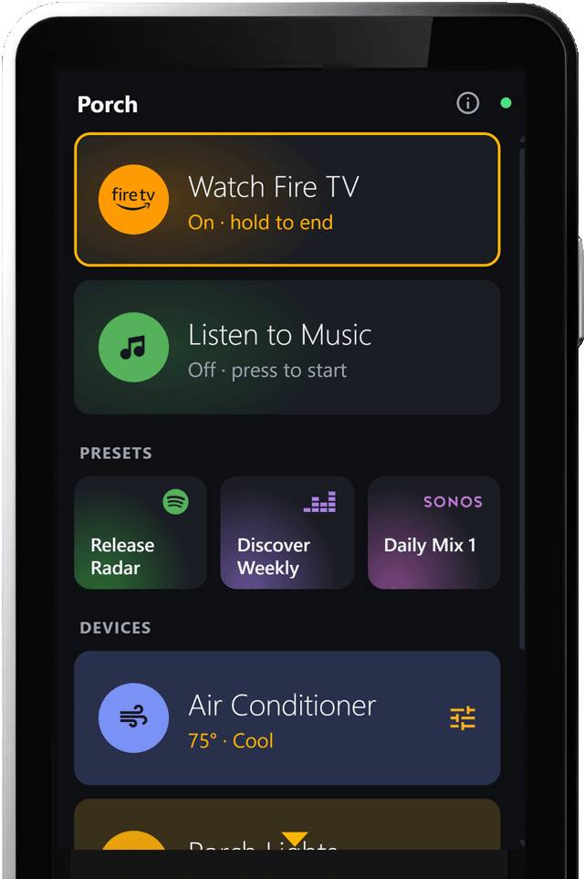
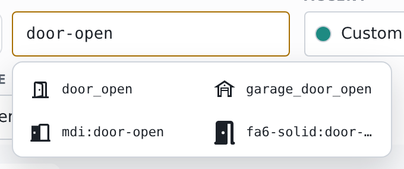
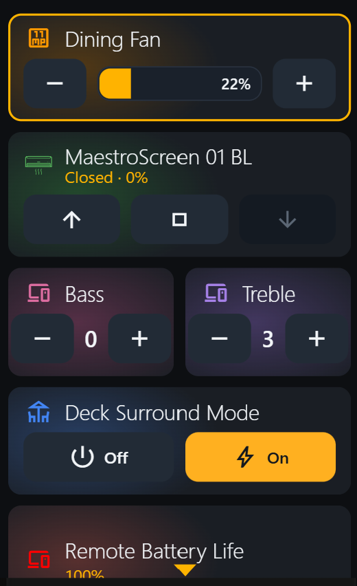
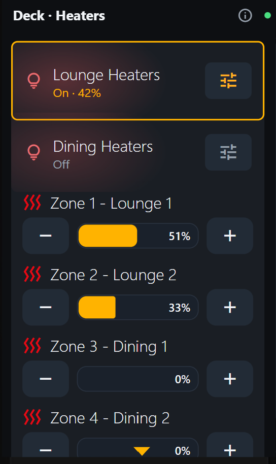
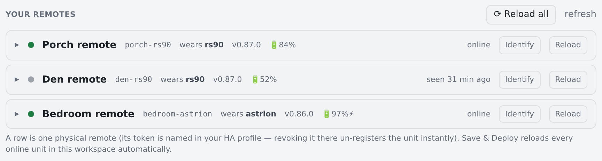
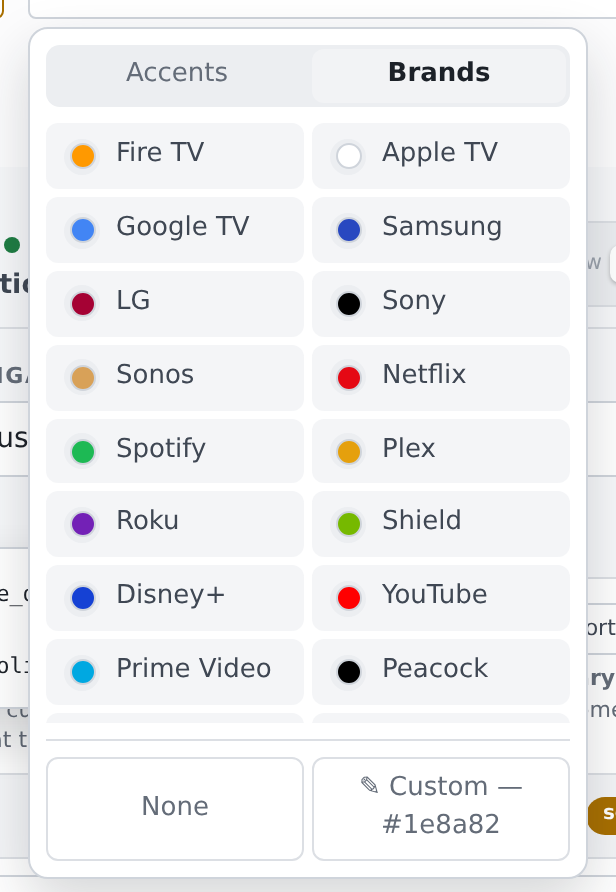

# Harmonium v0.87.0 — The Style release!

I'm biased, but I think the basic design language of Harmonium is pretty good. But the challenge with an "opinionated" platform is that it forces all our implementations to feel a bit samesy. The good news is, that they all look consistent. Bad news, is that they all look consistent. And on the subject of consistency, over the days and weeks, lots of high speed additions broke that consistency. A volume tile was one shape in one place and 10px taller in another. And slightly different than a brightness slider.

This release provides:

A standardized, documented, design language for every component, everywhere - but married to a level of configurability to let an opinionated design feel like *your* design; every device type now draws with the same control language; icon support finally covers everything installed in your Home Assistant. Around that core: proper controls for device types that never had them, a page that shows and manages your actual remotes, activities you can drive from outside of harmonium, and a long tail of fixes that came straight from daily use in a real house.

### In pictures

Four short pictorials walk the new ground with screenshots: [Control groups](../pictorials/Control%20Groups.md) · [Custom controllers](../pictorials/Custom%20Controller.md) · [Entity support and variants](../pictorials/Entity%20Support%20and%20variants.md) · [Styling tiles](../pictorials/Styling%20Tiles.md). The mental model behind controllers, casts and the preview is written up in [How controllers work](../cookbook/how-controllers-work.md).

## Design coherence

The theme of the release: one visual language, applied everywhere, that you can still make your own.

*One page wearing the new palette: a running Fire TV activity in its brand orange, Spotify green and Deezer purple on title-led presets below, and a plain device tile carrying an accent (tint) of its own.*

### Configuration that makes an opinionated design feel bespoke

Activities, presets, apps and even plain device tiles can carry an accent — either one of nine tuned colors (coral, fern, jade, indigo, violet, orchid, rose, azure, slate) or a **real brand color**: Fire TV's orange, Netflix's red, Spotify's green, and twenty more, adjusted only as much as needed to stay visible on a dark tile. Text on top of any of them automatically picks black or white for readability, including on Apple TV's white and Sony's black.

How the color shows is a style choice per tile or per section: just the icon tinted, a subtle tint across the tile, a soft glow behind the icon, or title-led versions of the same. When an activity is running, its tile warms up a notch — the color is the identity, the brightness is the state.

Streaming App tiles in the drawer are either full color logo tiles (we provide 21 of them, and you can add your own — see [TV app logos](../cookbook/app-logos.md)) or brand colored glyphs, out of the box; stock apps you haven't customized pick this up automatically. Your own hex colors still work exactly as before and are never deleted by trying a named color. And all of it is opt-in: nothing changes on your remotes until you pick an accent.

Every color in the palette is derived, not eyeballed — the same lightness and chroma math tunes all thirty-one, which is why they sit together so well. The full reasoning lives in [the identity palette design notes](../design/notes/identity-palette.md).

### A consistent display language across all tiles

Every control shape — sliders, steppers, chips, hold-to-confirm, the two-button pair — is drawn from one shared table that the Studio and the remote both read, so what you configure is what you get, at least thats the goal! The smaller rules got unified too:

- Two-line tiles (name plus status) align identically everywhere, at every size.
- Chevrons and gear icons mean one thing each now: a chevron takes you somewhere, a gear opens controls in place.
- Several tiles can be **grouped** into **one card** (a thermostat with its mode switch, say) — and the card now reads as one card: members drop their own backgrounds inside the group, while each keeps its own touch and d-pad behavior.
- Style options only do sensible things wherever they're offered. A title-led style on a tile that has no title band falls back to its plain version instead of half-applying.
- The right-hand icon marks on Title-style tiles sit flush and size together through one theme setting.
- On pages where the physical keys drive a device, the bottom Back/Home strip now names **which** device holds them, and the title bar washes in the running activity's accent — you always know whose remote you're holding, and whose activity you're inside.
- **The focus ring can be turned off.** A tester running Harmonium on an old iPhone asked for this: on a touch-only remote there is no d-pad, so the orange ring is just stuck on whatever you tapped last. **Theme → Focus ring → Off** paints it transparent everywhere (the cursor still exists underneath, so a d-pad remote sharing the config keeps working). A color works too, and a remote profile can carry the same setting — one phone with the ring off, the d-pad remotes with it on.

Why every control looks and behaves the way it does is written down in [the control language design notes](../design/notes/control-language.md).

### An icon library that spans your whole install

*One query, every set: Material, Home Assistant's MDI, and a Font Awesome pack answering together, each glyph drawn live.*

Type into any icon box and matches now come from **everywhere at once**: the built-in Material set, the brand icons pack, all of Home Assistant's own MDI icons, and — if you run the Custom Icons integration — every set you've activated there (Font Awesome, and friends). Type "door" and you get door glyphs from four sets, each drawn live, prefix matches first. Type "phu:" or "mdi:" to search one set only.

Two real bugs died here. MDI search used to be nearly useless because Harmonium was only reading a fraction of the icon list Home Assistant ships — it now reads all ~7,400. And searches no longer download whole icon packs into the Studio; they ask for just the matches, so the dropdown answers in a keystroke instead of hanging.

Icons still work the same way on the remote: everything a config references is baked into the deployed files at save time, so the remote never fetches a full icon pack. And if you use icon packs that only exist as dashboard resources, list their prefixes under **Theme → Icons** and the picker will ask those packs too. How the whole pipeline works — sources, banking, the browser bridge — is in [the icon sets design notes](../design/notes/icon-sets.md).

## Extended entity support

Until now, some device types got beautiful controls (media players, fans, covers) and the rest got a generic launcher. This release closes the gap:

 

*Left: the new controls — a switch pair, a lock with hold-to-unlock, a number slider reading its range from the device, dropdown chips, a scene button. Right: the new light dimmer, twice over, grouped into one card.*

- **All entities** support rendering as (a) A Launcher Tile, (b) a Control Tile. When a Control Tile is selected, there is typically a **large and compact** variant.
- **Switches** show a two-button Off/On pair. The side that's currently active is lit; the other is raised and ready. No status line needed — the buttons are the status.
- **Buttons, scenes and script triggers** are now a single tile that IS the button. Tap it and it flashes "Sent" so you know the press landed.
- **Locks** get the careful treatment they deserve: locking is one tap, but unlocking takes a press-and-hold — half a second, with a fill that grows under your finger, and letting go early cancels. A jammed lock shows in red with a Retry. If your lock can also open a door (a latch), that hold applies there too. Need some field testing on this one - I only have a basic one.
- **Numbers** (a target temperature, a fan percentage) become sliders and steppers that read their range and step size from the device itself — a thermostat that moves in half degrees steps in half degrees.
- **Dropdowns** (input selects, source pickers) get a proper picker page, or inline chips if you prefer.
- **Lights get a real dimmer.** "Light control" draws a brightness track right in the tile — drag to dim, tap − / + to nudge, and sliding to zero honestly turns the light off. A compact form puts the value and − / + on the row instead. (Color and color temperature are on the list for a later release.)
- **Thermostats and aircons get a temperature control.** The same track, mapped to the device's own range — drag to set the target, − / + step by the device's own increment (half degrees on a half-degree thermostat), and the status line keeps the mode and the current temperature so target and actual never blur. The far left is the minimum setpoint, not "off" — a thermostat's off is the power button.
- **Fans** on speed-only hardware (no real on/off command) now toggle through their speed setting instead of erroring, and **covers** can flip their displayed direction with one setting when "open" on the device means "closed" on your wall.
- **Open a device's page and the remote becomes that device's remote.** Tap the TV in your activity's cast — even one the activity gave no buttons to — and for as long as you're on its page, the d-pad, volume and source keys all drive *that* device, speaking its own key language. Step back and the activity has its keys again. No more fishing out the old remote to reach one buried menu. This is an upgrade from earlier betas, where the activity's key profile bled through onto a device page — standing on the Samsung's page, the arrows still went to the Fire TV. Now it's the device's own **device controller** that's active: the stock Media Device page, or a custom copy the device adopts from its card in Pre-wired Devices. The mental model behind all of it — the two kinds of controller, casts and context, what the preview really shows, who gets the keys — is written up in [How controllers work](../cookbook/how-controllers-work.md).

You choose how any entity draws using the same "Draws as" menu everywhere, and if your config used older spellings for any of this, it's modernized automatically when the Studio loads it — with the count reported, and nothing you wrote by hand ever silently rewritten.

## Activities, casts and controllers

The cast is one ordered list now — pre-wired devices, loose entities and groups side by side — and a few things that used to fight each other have one owner each.

- **Groups grew up.** A group's members draw the way each member's own ⚙ says, with a small tag on the row telling you what that resolves to; the group card carries a status line you can write (`{count}` and `{active}` substitute live, ∅ means no line at all); member rows inside a group have their own order arrows for the group's page.
- **One order lever.** The Controller tab's ↑↓ is what stacks the panel — Now Playing, the Volume band, the group cards, Devices. The Setup tab no longer carries order arrows on the cast; they were a second lever fighting the first.
- **Draw as Nothing.** A cast member can stay in the cast — its roles, keys and claims wired — and draw no tile of its own.
- **Lands on.** An activity's controller picker offers activity surfaces only, stock or custom, with the ones suiting the activity's shape first. Device pages never appear there: a device adopts its page from its own card in Pre-wired Devices, and a custom copy of a device page is a template any compatible device can adopt.
- **The controller editor shows the controller.** Pick any activity to preview and you see that controller's own settings with that activity's cast. An activity's Controller-tab overrides (Now Playing style, band switches, order, labels, volume style) apply on the remote and in the activity's own card — never in the controller editor. Device pages are flagged `$device` in the controllers tree and on their edit page.
- **Now Playing defaults to Art.** The stock TV and Music controllers and the Media Device page all default to the Art hero; "Auto" means that default. The stock Media Device page is a proper built-in now (Art Now Playing, slider volume) with per-device custom copies.
- **The control target tells the truth.** On a device page it comes from the device — Navigation is its D-pad role, Power and Volume its roles — and the panel says so for the device you're previewing. A Fill-in-defaults button seeds the TV-surface shape. The TV-tuner switch is the same thing as `ch_up` / `ch_down` in the keys passed to the device, and now says so.

## The upgrade report

When the Studio opens on a newer version than it last saw, it says what changed and what it did: built-ins it refreshed, your edited copies it preserved as forks, older spellings it modernized, and — separately — the behavior changes in this release, one line each. Nothing is rewritten silently; every heal is reported in the status line and listed in the report, and dismissing it is remembered at Save & Deploy. The design: [upgrade-audit.md](../design/notes/upgrade-audit.md).

## Remote management

Remotes & keymaps grew the section it always needed: **Your remotes**. Every remote that runs Harmonium announces itself, and the page lists them — online/asleep dot, which profile it wears, engine version, battery, last seen.

*The fleet at a glance: who's online, who's asleep, what each remote wears and how its battery is doing.*

- **Save & Deploy now reloads every remote in the workspace.** Change a page, hit save, and all four remotes in the house pick it up — no more walking around pressing reload buttons.
- **Identify** flashes the remote's name on its own screen, so you can tell which row is the one in your hand.
- Link a remote to its **Fully Kiosk** device and the row shows live battery and the page it's currently on, and leads with a friendly name ("Porch remote" instead of a serial).
- **Create battery alert** is one click: it creates a pre-wired automation from the battery-alerts blueprint, pointed at that remote's sensors, with sensible warning levels. Tune it later in Home Assistant if you like.

All of this was built to cost the battery nothing: remotes report in on a heartbeat they were already sending, and commands ride the connection they already keep open. The fleet's design — why remotes announce themselves, why profiles are outfits — is in [the remote fleet design notes](../design/notes/remote-fleet.md).

## External control

Activities aren't just for remotes. Wall switches, dashboards and automations can start and stop them through two services — `harmonium.set_activity` and `harmonium.run` — and this release makes that path solid:

- **Start and stop sequences no longer need routing steps.** Running an activity's start sequence — from a tap, a Test, a wall switch, an automation — flips the room to that activity automatically; running its stop clears the room, but only if that activity still owns it (ending Watch TV never kills the Music you switched to). Generated sequences are now pure device work, and untouched ones slim down automatically.
- A start sequence with no steps at all is legal now — some activities really are just "point the room here."
- **Music presets that "didn't start" are fixed.** If an activity's only proof of running is the playback itself (a Sonos that reports "playing"), the preset used to wait forever for proof that couldn't exist yet, then give up. Now, once the room has agreed to the activity, the preset fires. Press "Beach Radio", get Beach Radio.

## A consistent configuration UI

The Studio now treats every kind of tile the same way it treats the remote: one grammar, everywhere.

- Activity, preset and device cards all use the same two tidy rows — name and id up top, icon/accent/style below.
- Menus offer only what their tiles can actually wear: a device tile's style menu doesn't list title-led looks it has no title band for, and a section's accent-style menu matches what's in the section.
- The accent picker is a compact button that opens a two-tab panel — **Accents | Brands** — with every swatch on a small chip so light and dark colors both read, and it now floats above everything instead of getting clipped inside collapsed cards.  

- **▶ Test runs what's on your screen** — unsaved edits included. That's the whole point of testing. Saving is still what sends it to the remote.
- Anything the Studio modernizes or slims down on load is reported in the status line, never done silently.

## Errata

- **The preview has a padlock.** Lock it and it stops jumping to whatever you click while you tune colors on one screen.
- **The page list shows real nesting.** A page under Deck under Home now indents under Deck, instead of pretending to be its sibling.
- Launcher labels stopped truncating early — a spacing rule was charging the icon trail twice, and long names like "Zone 1 - Lounge" now use the room they always had.
- A half-typed entity id in the Studio can no longer break the live connection for the whole preview.
- Derived dialects (a dialect defined as "like that one, plus/minus these keys") are now resolved by the integration itself, so they work everywhere, not just in the Studio preview.
- **Tapping an already-running activity in a house with more than one room no longer throws a "Validation error".** The tap repairs the activity select of the room that owns the activity, not the first room's. Reported and diagnosed by **fahrer16** (PR #8) — thank you.

## Upgrading

Restart Home Assistant after updating — this release changes the integration, not just the remote files. On first load the Studio will modernize older control spellings and slim down untouched generated sequences; it will also fold loose entities into the cast's order, release device-bound copies into templates, turn the old TV-tuner flag into ch_up / ch_down, and bring the stock TV and Music controllers to their new generation. All of it is reported in the status line and the upgrade report, and none of it touches anything you edited by hand. Save & Deploy once to make it permanent. Colors are entirely opt-in: nothing changes on your remotes until you pick an accent.
